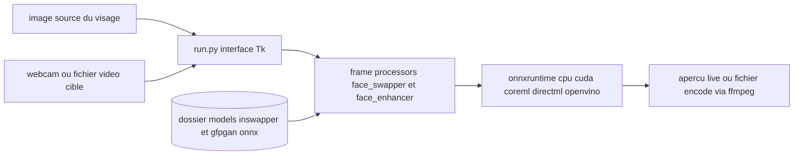

# hacksider/Deep-Live-Cam

> **Desktop app that swaps a face live on a webcam or a video, from a single photo.**

## The problem

Replacing a face in a video or a webcam feed used to require a training set, a deepfake
pipeline and hours of compute. Here the input is one image, and the result shows up in real
time — the README boils the workflow down to three clicks: pick a face, pick a camera, go
live.

## What it actually does

Two modes only. Image/video: pick a source face image and a target image or video, click
"Start", and the output lands in a directory named after the target video. Webcam: pick a
source face, click "Live", wait 10 to 30 seconds for the preview, then use a screen capture
tool such as OBS to stream it. Around the swap itself the README documents a mouth mask that
keeps the original mouth so lip movement stays accurate, face mapping to put different faces
on several subjects at once, and a many-faces mode. The inference is not home-grown: it
relies on two ONNX models downloaded separately, `inswapper_128_fp16.onnx` (from insightface)
and `gfpgan-1024.onnx` for enhancement. The README itself flags the command line mode as
unmaintained.

## How it is wired



The single entry point is `run.py`, which opens the GUI. Frames come in either from the
source photo or from the camera or target video. Work is organised as "frame processors"
(`face_swapper`, `face_enhancer`, per the command line help quoted in the README), which load
the two `.onnx` files you drop by hand into the `models` folder. Execution goes through
onnxruntime, whose provider is chosen with `--execution-provider`: `cpu` by default, or
`cuda`, `coreml`, `directml`, `openvino`. On the way out, ffmpeg handles video operations and
the live preview stays inside the window — you capture it yourself to stream.

## Trying it

```bash
git clone --depth 1 https://github.com/hacksider/Deep-Live-Cam.git
cd Deep-Live-Cam
python3 -m venv venv
source venv/bin/activate
pip install -r requirements.txt
python run.py
```

Before `python run.py` you must manually download `gfpgan-1024.onnx` and
`inswapper_128_fp16.onnx` from the `hacksider/deep-live-cam` HuggingFace repository and place
them in the `models` folder. For an NVIDIA card the README adds:

```bash
pip install -U torch torchvision torchaudio --index-url https://download.pytorch.org/whl/cu128
pip uninstall onnxruntime onnxruntime-gpu
pip install onnxruntime-gpu==1.26.0
python run.py --execution-provider cuda
```

## Cost and traps

The code is free, but the README pushes a pre-built "Ultimate" edition sold on a separate
website with reserved features and support — hence freemium. Technically: Python 3.11
minimum and 3.14 recommended, ffmpeg, Visual Studio runtimes on Windows, a separate tkinter
install on macOS. The README states the manual install "requires technical skills and is not
for beginners". Each execution provider means uninstalling and reinstalling an onnxruntime
variant, and for OpenVINO the versions must match OpenVINO one-to-one per a table in the
README. Roughly 300MB of models download on first run. The main legal trap: the insightface
model is explicitly restricted to non-commercial research use, which the README repeats in
its credits — the repo is AGPL-3.0, but the weights it consumes are not free for commercial
use. The README also sets an ethical use policy, mentions a built-in check blocking
inappropriate media, and warns the project may be shut down or watermarked if the law
requires it.

## What it is not

Not a library: there is no documented Python API, only a GUI launched by `run.py`, and the
CLI is declared unmaintained. Not a broadcasting tool either: nothing pushes the stream into
Zoom, Discord or Twitch, the README points you to OBS screen capture. Not a training system —
no learning on your face, only inference with pre-trained weights. And not a harmless toy:
the press review in the README (Ars Technica, TrendMicro on eKYC fraud) shows the tool is
read as a potential fraud instrument.

## Alternatives

The README names its own ancestors: `s0md3v/roop`, which the credits footnote calls the base
of the code, and `GosuDRM` for an open version of roop; the swapping core comes from
`deepinsight/insightface`. Among the catalogue neighbours, GetStream/Vision-Agents and
steven-jianhao-li/zotero-AI-Butler address different subjects: no comparable alternative in
the catalogue outside the roop/insightface lineage.

## For you

For a data/AI profile the value is the machinery rather than the use: a real-time ONNX
pipeline spanning CUDA, CoreML, DirectML and OpenVINO is a readable case study in porting
video inference across heterogeneous hardware. The subject is also a useful reference point
for deepfake detection and identity-verification robustness. Any professional reuse, however,
runs into AGPL-3.0 plus the non-commercial insightface licence: worth watching and reading,
not integrating.
