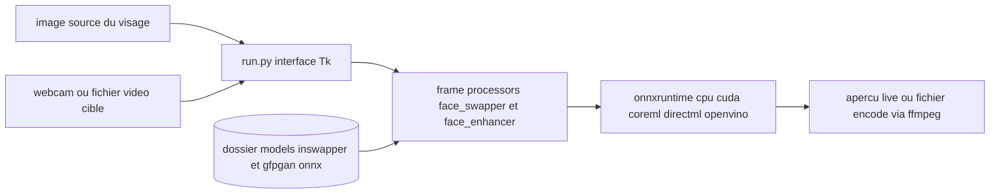

# hacksider/Deep-Live-Cam

> **Application de bureau qui remplace un visage en direct sur webcam ou vidéo, à partir d'une seule photo.**

## Le problème

Substituer un visage dans une vidéo ou un flux webcam demandait jusqu'ici un jeu d'images
d'entraînement, un pipeline de deepfake et des heures de calcul. Ici l'entrée est une seule
image source, et le résultat s'affiche en temps réel — le README résume l'usage à trois
clics : choisir un visage, choisir une caméra, lancer le direct.

## Ce que ça fait vraiment

Deux modes seulement : image/vidéo (on choisit une image source et une cible, on clique
« Start », la sortie est écrite dans un dossier nommé d'après la vidéo cible) et webcam (on
clique « Live », l'aperçu apparaît après 10 à 30 secondes, et on capture l'écran avec un
outil comme OBS pour diffuser). Autour du remplacement de visage, le README documente un
masque de bouche qui conserve la bouche d'origine pour le mouvement des lèvres, un mappage
de visages permettant d'appliquer des visages différents à plusieurs sujets simultanément,
et un mode « many faces ». Le travail d'inférence n'est pas fait maison : il repose sur
deux modèles ONNX téléchargés séparément, `inswapper_128_fp16.onnx` (issu d'insightface)
et `gfpgan-1024.onnx` pour l'amélioration du rendu. Le README signale lui-même que le mode
ligne de commande n'est plus maintenu (« Command Line Arguments (Unmaintained) »).

## Comment c'est branché



Le point d'entrée unique est `run.py`, qui ouvre l'interface. Les images entrent d'un côté
par la photo source, de l'autre par la caméra ou la vidéo cible. Les traitements sont
organisés en « frame processors » (`face_swapper`, `face_enhancer`, selon l'aide en ligne
de commande citée dans le README), qui chargent les deux fichiers `.onnx` déposés
manuellement dans le dossier `models`. L'exécution passe par onnxruntime, dont on choisit le
fournisseur via `--execution-provider` : `cpu` par défaut, `cuda`, `coreml`, `directml` ou
`openvino`. En sortie, ffmpeg gère les opérations vidéo et l'aperçu direct s'affiche dans
la fenêtre, à capturer soi-même pour le streaming.

## Essayer

```bash
git clone --depth 1 https://github.com/hacksider/Deep-Live-Cam.git
cd Deep-Live-Cam
python3 -m venv venv
source venv/bin/activate
pip install -r requirements.txt
python run.py
```

Avant `python run.py`, il faut télécharger à la main `gfpgan-1024.onnx` et
`inswapper_128_fp16.onnx` depuis le dépôt HuggingFace `hacksider/deep-live-cam` et les
placer dans le dossier `models`. Pour une carte NVIDIA, le README ajoute :

```bash
pip install -U torch torchvision torchaudio --index-url https://download.pytorch.org/whl/cu128
pip uninstall onnxruntime onnxruntime-gpu
pip install onnxruntime-gpu==1.26.0
python run.py --execution-provider cuda
```

## Coût et pièges

Le code est gratuit, mais le README met en avant une version pré-compilée « Ultimate »
vendue sur un site tiers, avec des fonctionnalités et un support réservés — d'où le
freemium. Côté technique : Python 3.11 minimum, 3.14 recommandé, ffmpeg et les runtimes
Visual Studio sous Windows, tkinter installé séparément sur macOS. Le README annonce
lui-même que l'installation manuelle « requires technical skills and is not for beginners ».
Chaque fournisseur d'exécution impose de désinstaller puis réinstaller une variante
d'onnxruntime, et pour OpenVINO les versions doivent correspondre une à une à celles
d'OpenVINO selon un tableau fourni. Environ 300 Mo de modèles se téléchargent à la première
exécution. Piège juridique majeur : le modèle insightface est explicitement limité à un
usage de recherche non commercial, ce que le README rappelle dans les crédits — le dépôt
est en AGPL-3.0, mais les poids qu'il consomme ne sont pas libres d'usage commercial. Le
README impose enfin un cadre d'usage éthique, mentionne un contrôle intégré bloquant les
contenus inappropriés, et prévient que le projet peut être arrêté ou filigrané si la loi
l'exige.

## Ce que ce n'est pas

Ce n'est pas une bibliothèque : il n'y a pas d'API Python documentée, seulement une
application graphique lancée par `run.py`, et le mode ligne de commande est déclaré non
maintenu. Ce n'est pas non plus un outil de diffusion : rien ne pousse le flux vers Zoom,
Discord ou Twitch, le README renvoie à une capture d'écran via OBS. Ce n'est pas un
entraîneur de modèles — aucun apprentissage sur votre visage, seulement de l'inférence avec
des poids pré-entraînés. Et ce n'est pas un jouet sans conséquence : la revue de presse
citée dans le README (Ars Technica, TrendMicro sur les fraudes eKYC) montre que l'outil est
lu par la presse comme un instrument de fraude potentielle.

## Alternatives

Le README nomme ses propres ancêtres : `s0md3v/roop`, dont il est issu selon la note de bas
de page des crédits, et `GosuDRM` pour une version ouverte de roop ; le cœur de l'échange de
visage vient de `deepinsight/insightface`. Parmi les voisins fournis par le catalogue,
GetStream/Vision-Agents et steven-jianhao-li/zotero-AI-Butler ne traitent pas le même sujet :
aucune alternative comparable dans le catalogue en dehors de la lignée roop/insightface.

## Pour toi

Pour un profil data / IA, l'intérêt est moins l'usage que la mécanique : un pipeline ONNX
temps réel, multi-fournisseurs d'exécution (CUDA, CoreML, DirectML, OpenVINO), est un cas
d'école lisible pour comprendre comment on porte une inférence vidéo sur des matériels
hétérogènes. Le sujet est aussi un référentiel utile côté détection de deepfakes et
robustesse des vérifications d'identité. En revanche, toute reprise dans un cadre
professionnel bute sur l'AGPL-3.0 et sur la licence non commerciale d'insightface : à
surveiller et à étudier, pas à intégrer.
