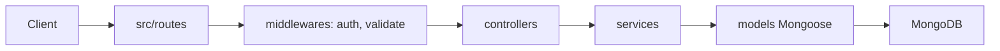

# hagopj13/node-express-boilerplate

> Gabarit d'API REST Node/Express/Mongoose avec authentification JWT, validation, tests et Docker.

## Le problème
Démarrer une API REST propre exige de recâbler à chaque fois auth, validation, logs et tests.

## Ce que ça fait vraiment
Génère un projet via `npx create-nodejs-express-app`. Contient passport/JWT, Joi, Winston/Morgan, Jest, Swagger, PM2, helmet, Docker, ESLint/Prettier. Couches routes, contrôleurs, services, modèles Mongoose avec plugins `toJSON` et `paginate`.

## Comment c'est branché


## Essayer
```bash
npx create-nodejs-express-app <project-name>
yarn install
cp .env.example .env
yarn dev
yarn test
```

## Coût et pièges
Gratuit ; MongoDB et un SMTP requis. Dernier push en juillet 2024, CI Travis : dépendances probablement à mettre à jour. Le secret JWT d'exemple doit être changé.

## Ce que ce n'est pas
Pas « prêt pour la production » sans audit des dépendances ni mise à jour.

## Alternatives
Inspirations citées : danielfsousa/express-rest-es2017-boilerplate, madhums/node-express-mongoose, kunalkapadia/express-mongoose-es6-rest-api.

## Pour toi
Ignorer : gabarit web généraliste, vieillissant et sans rapport avec data/IA/MLOps.

