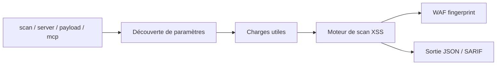

# hahwul/dalfox

> Scanner XSS en ligne de commande (réécrit en Rust en v3) pour tester des paramètres web.

## Le problème
Trouver les points d'injection XSS d'une application web à la main est long et répétitif.

## Ce que ça fait vraiment
Sous-commandes `scan` (URL, fichier, pipe ou requête brute), `server` (API REST), `payload` et `mcp` (serveur stdio). Analyse de paramètres, recherche statique, XSS réfléchi, stocké et DOM avec vérification, détection de WAF avec score, en-têtes et cookies personnalisés, sorties JSON, SARIF, Markdown, TOML. Charges utiles personnalisées ou distantes.

## Comment c'est branché


## Essayer
```bash
brew install dalfox
dalfox scan http://example.com -b https://callback
cat urls.txt | dalfox scan --headers "AuthToken: xxx"
dalfox scan 'https://example.com/?q=FUZZ&page=1' --inject-marker FUZZ
```

## Coût et pièges
Gratuit. Le schéma d'architecture décrit une arborescence Go (cmd/, pkg/) alors que le README annonce une réécriture Rust : il est périmé, les branches Go restent sous `v2`. À n'utiliser que sur des cibles autorisées.

## Ce que ce n'est pas
Pas un scanner de vulnérabilités généraliste : il vise le XSS. Pas une preuve d'absence de faille.

## Alternatives
Aucune alternative nommée dans le README.

## Pour toi
À surveiller : utile pour tester tes propres interfaces web (dashboards, API), sans concerner directement la donnée ou l'IA.

