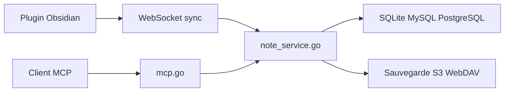

# haierkeys/fast-note-sync-service

> Serveur Go auto-hébergé synchronisant des coffres Obsidian, avec API REST et serveur MCP pour agents IA.

## Le problème
Synchroniser des notes Obsidian entre appareils sans service tiers, tout en laissant un assistant IA les lire et les écrire.

## Ce que ça fait vraiment
Un serveur Go (WebSocket + protobuf pour la synchro temps réel, REST, panneau d'admin React) gère coffres, notes, historique, corbeille, partage, pièces jointes par morceaux, sauvegardes S3/OSS/R2/WebDAV et push Git. Il expose aussi des outils MCP (Streamable HTTP et SSE). Bases : SQLite, MySQL ou PostgreSQL. Un plugin Obsidian client est requis.

## Comment c'est branché


## Essayer
```bash
docker pull haierkeys/fast-note-sync-service:latest
docker compose up -d
./fast-note-sync-service run -c config/config.yaml
```

## Coût et pièges
Gratuit ; hébergement à ta charge. Le script d'installation est un `curl | bash`. Le README n'affiche pas la licence Apache-2.0 mais le catalogue si.

## Ce que ce n'est pas
Pas un client Obsidian : sans plugin, pas de données. Pas une base de connaissances IA en soi.

## Alternatives
Le README cite des clients tiers : FastNodeSync-CLI, go-fast-note-sync, Fast-note-sync-docker.

## Pour toi
À surveiller : le serveur MCP donnant un agent accès à tes notes est un cas d'usage concret, mais 166 issues ouvertes et un seul mainteneur.

