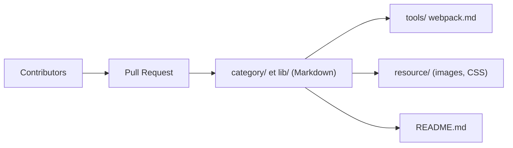

# haizlin/fe-interview

> Banque de plus de 6000 questions d'entretien front-end en chinois, avec une question par jour.

## Le problème
Se préparer aux entretiens front-end demande un corpus de questions large, organisé par thème et mis à jour régulièrement.

## Ce que ça fait vraiment
Dépôt de fichiers Markdown classés par catégorie (HTML, CSS, JS, compétences douces) et par framework (Vue, React, AngularJs, Node, jQuery, mini-programmes), plus webpack. Le README annonce une nouvelle question chaque jour (2386 jours écoulés au 2025-10-27) et un système de contribution par pull request. Aucun code applicatif : contenu uniquement.

## Comment c'est branché

## Essayer
Aucune commande : on lit le README et les dossiers de questions, ou on ouvre une pull request pour en proposer.

## Coût et pièges
Gratuit. Rédigé en chinois. En tête de README, une promotion pour une application de badminton (« bientôt open source »). Le dépôt cumule 6 259 issues ouvertes. Dernier push le 2025-10-26, à la limite d'un an.

## Ce que ce n'est pas
Ce n'est pas un cours avec réponses : les questions sont là pour être répondues par le lecteur. Le générateur de site évoqué par l'architecture est une hypothèse du diagramme, non documentée.

## Alternatives
- Aucune alternative nommée dans le README.

## Pour toi
Ignorer : préparation d'entretien front-end en chinois, sans intérêt pour un profil data/IA.

