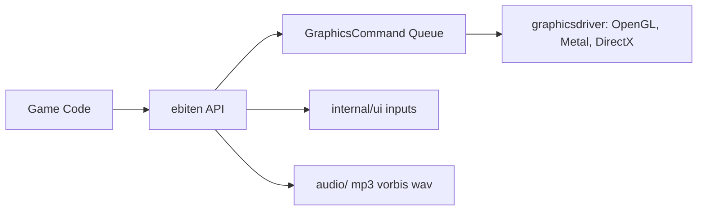

# hajimehoshi/ebiten

> Moteur de jeu 2D simple pour Go, multiplateforme, pour développeurs de jeux.

## Le problème
Écrire un jeu 2D portable en Go sans passer par du C ou des moteurs lourds.

## Ce que ça fait vraiment
API à boucle Update/Draw. Graphismes 2D (matrices, shaders, rendu hors écran, atlas automatique), entrées (souris, clavier, manettes, tactile), audio Ogg/Vorbis, MP3, WAV. Pilotes graphiques DirectX, Metal, OpenGL. Cible Windows, macOS, Linux, FreeBSD, Android, iOS, WebAssembly, Switch et Xbox (Cgo requis sur certaines).

## Comment c'est branché

## Essayer
Aucune commande dans le README : il renvoie au site ebitengine.org et à la page d'installation.

## Coût et pièges
Gratuit. Cgo requis pour Android, iOS, Switch et Xbox. Le support Xbox est limité. 289 issues ouvertes.

## Ce que ce n'est pas
Pas un moteur 3D ni un éditeur visuel : c'est une bibliothèque de code.

## Alternatives
Aucune alternative citée dans le README.

## Pour toi
À ignorer : moteur de jeu 2D sans lien avec data/IA/MLOps, à garder en tête seulement pour des visualisations interactives en Go.

