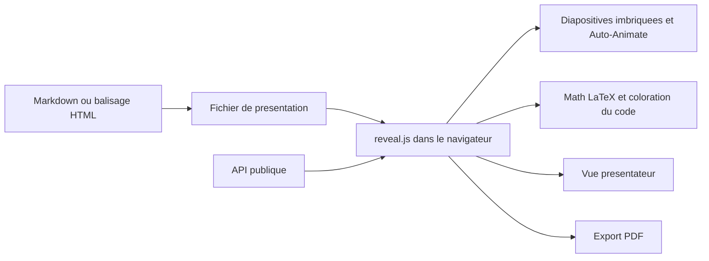

# hakimel/reveal.js

> **An HTML framework for writing presentations as text instead of in an office suite.**

## The problem

Without it, a slide deck lives inside a proprietary binary: no diff, no version control, no
clean way to paste syntax-highlighted code, and a PDF export tied to whatever application is
installed. The README does not state this problem itself; it only describes the project as an
"open source HTML presentation framework".

## What it actually does

The repository ships a presentation framework in HTML: slides are markup, the browser renders
them. The README lists the shipped features: nested (vertical) slides, Markdown authoring,
Auto-Animate, PDF export, speaker notes, LaTeX typesetting for maths, syntax-highlighted code,
and a documented public API. The README calls the feature set "powerful" without detailing the
implementation — that is the README's adjective, not a fact restated here. What the repository
does not do itself is graphical editing, which it points to the third-party slides.com service
for, built by the same people.

## How it is wired



No code-derived diagram ships with this repository, so the graph above is inferred from the
README alone. It shows the announced chain: content is authored as markup or Markdown, the
framework renders it in a browser, and the listed features (notes, maths, code, PDF) are
outputs of that same rendering. Real file names cannot be verified from here.

## Trying it

```bash
# no command is documented in the README:
# it points to https://revealjs.com/installation
```

The README contains neither an install nor a start command, only links to the online
documentation. Nothing is reconstructed here.

## Cost and traps

The README states "for free" and an MIT license, with no API key and no account required: a
browser is enough. Two indirect costs still show up in the README: the graphical editor runs
through slides.com, a hosted third-party service, and the official video course is explicitly
marked "paid". Everything else — hosting the decks, the publishing pipeline — is undocumented
in the README.

## What it is not

It is not a presentation editor: there is no graphical interface in the repository, and the
README points to slides.com for that. It is not a hosted service nor a content generator
either — you write the slides yourself. Finally, PDF export is listed as a feature, but the
README describes neither its limits nor how it works.

## Alternatives

The README names no competing repository; it only cites slides.com, which is a service rather
than a repository. Among the catalogue neighbours provided (avelino/awesome-go, iptv-org/iptv,
harry0703/MoneyPrinterTurbo, microsoft/TypeScript), none deals with presentations: no
comparable alternative in the catalogue.

## For you

Useful if you present model results or architecture diagrams and want the deck to live in the
repository, versioned, with highlighted code and LaTeX formulas. Not directly related to a
data or MLOps pipeline: it is a reporting tool, not a production one.
