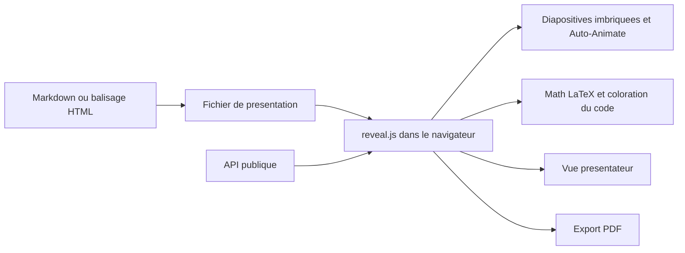

# hakimel/reveal.js

> **Un cadre HTML pour écrire ses présentations en texte plutôt que dans un outil bureautique.**

## Le problème

Sans lui, une présentation vit dans un binaire propriétaire : pas de diff, pas de gestion de
version, pas de copier-coller de code correctement colorisé, et un export PDF qui dépend de
l'outil installé. Le README ne formule pas ce problème lui-même, il se contente de décrire le
cadre comme « open source HTML presentation framework ».

## Ce que ça fait vraiment

Le dépôt fournit un cadre de présentation en HTML : les diapositives sont du balisage, le
navigateur les affiche. Le README énumère les fonctions livrées : diapositives imbriquées
(vertical slides), écriture en Markdown, Auto-Animate, export PDF, notes du présentateur
(speaker view), composition LaTeX pour les maths, coloration syntaxique du code, et une API
publique documentée. Le README dit « powerful feature set » sans détailler l'implémentation :
adjectif du README, non repris ici comme fait. Ce que le dépôt ne fait pas lui-même :
l'édition graphique, renvoyée vers le service tiers slides.com, fait par la même équipe.

## Comment c'est branché



Aucun diagramme tiré du code n'accompagne ce dépôt : le schéma ci-dessus est déduit du seul
README. Il montre la chaîne annoncée — on écrit le contenu en balisage ou en Markdown, le
cadre le rend dans un navigateur, et les fonctions citées (notes, maths, code, PDF) sont des
sorties de ce même rendu. Les noms de fichiers réels ne sont pas vérifiables ici.

## Essayer

```bash
# aucune commande n'est documentée dans le README :
# il renvoie vers la page https://revealjs.com/installation
```

Le README ne contient ni commande d'installation ni commande de démarrage, seulement des liens
vers la documentation en ligne. Rien n'est reconstruit ici.

## Coût et pièges

Le README annonce « for free » et une licence MIT, sans clé d'API ni compte à créer : il suffit
d'un navigateur. Deux coûts indirects apparaissent quand même dans le README : l'éditeur
graphique passe par slides.com, un service tiers hébergé, et le cours vidéo officiel est
explicitement marqué « paid ». Le reste de l'ingénierie — hébergement des diapositives,
chaîne de publication — n'est pas documenté dans le README.

## Ce que ce n'est pas

Ce n'est pas un éditeur de présentation : il n'y a pas d'interface graphique dans le dépôt, le
README renvoie vers slides.com pour cela. Ce n'est pas non plus un service hébergé ni un
générateur de contenu : on écrit ses diapositives soi-même. Enfin, l'export PDF est cité comme
fonction, mais le README ne décrit ni ses limites ni son mode opératoire.

## Alternatives

Le README ne nomme aucun dépôt concurrent ; il ne cite que slides.com, qui est un service et
non un dépôt. Parmi les voisins fournis par le catalogue (avelino/awesome-go, iptv-org/iptv,
harry0703/MoneyPrinterTurbo, microsoft/TypeScript), aucun ne traite de présentations :
aucune alternative comparable dans le catalogue.

## Pour toi

Utile si tu présentes des résultats de modèles ou des schémas d'architecture et que tu veux
que le support vive dans le dépôt, versionné, avec du code colorisé et des formules LaTeX.
Sans rapport direct avec une chaîne data ou MLOps : c'est un outil de restitution, pas de
production.
