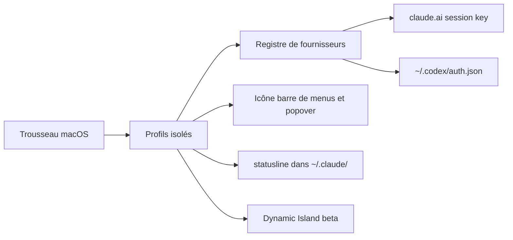

# hamed-elfayome/Claude-Usage-Tracker

> Application macOS de barre de menus qui suit en temps réel la consommation de tes comptes Claude.

## Le problème
On ne sait pas où on en est de sa fenêtre de cinq heures ni de sa limite hebdomadaire avant de la heurter.
Avec plusieurs comptes, c'est pire.

## Ce que ça fait vraiment
Suit session, hebdomadaire, par modèle (Fable, Opus, Sonnet, Design), usage console API et coûts, par profil.
Profils illimités avec identifiants isolés dans le trousseau macOS, et bascule automatique au plafond atteint.
Intégration Claude Code : synchronisation des comptes CLI, lanceurs `claude-<profil>` avec leur `CLAUDE_CONFIG_DIR`.
Depuis la v3.3.0, les profils peuvent aussi suivre OpenAI Codex, sur une architecture de registre extensible.

## Comment c'est branché


## Essayer
```bash
brew install --cask hamed-elfayome/claude-usage/claude-usage-tracker
```

## Coût et pièges
macOS 14 (Sonoma) minimum : rien pour Linux ni Windows.
Le mode manuel demande d'extraire le cookie `sessionKey` du navigateur ; un signal anonyme de version part toutes les 24 h.

## Ce que ce n'est pas
Pas un outil de maîtrise de dépense : il observe, il ne limite rien.
Pas officiel Anthropic, malgré la profondeur de l'intégration Claude Code.
Le Dynamic Island est en bêta et lit passivement : il ne peut ni approuver ni répondre à ta place.

## Alternatives
Aucune alternative nommée dans le README.

## Pour toi
Tu travailles sous WSL2 : inutilisable. À noter seulement pour le principe du statusline de quota.
