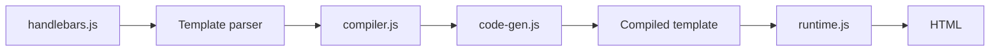

# handlebars-lang/handlebars.js

> Moteur de templates sémantiques JavaScript, quasi compatible Mustache, pour développeurs web.

## Le problème
Générer du HTML à partir de données sans mélanger logique et présentation.

## Ce que ça fait vraiment
`Handlebars.compile` transforme un gabarit en fonction qui prend un contexte. Ajoute à Mustache les chemins imbriqués, les helpers, les blocs, les littéraux et les commentaires. Les gabarits peuvent être précompilés (CLI) avec un runtime autonome pour démarrer plus vite. Gardes d'accès aux propriétés et chaînes sûres pour l'échappement. Suite de benchmarks fournie.

## Comment c'est branché


## Essayer
```js
var template = Handlebars.compile(source);
var result = template(data);
```
```bash
pnpm run bench
```

## Coût et pièges
Gratuit. Différences avec Mustache : pas de recherche récursive par défaut (option `compat`, plus lente), pas de lambdas Mustache, pas de délimiteurs alternatifs.

## Ce que ce n'est pas
Pas un framework de vues : un moteur de gabarits. La commande d'installation n'est pas dans le README fourni.

## Alternatives
Aucune alternative nommée dans le README (Mustache est cité comme base de compatibilité).

## Pour toi
Utile pour générer des rapports ou des e-mails à partir de données ; tu n'en as besoin que si ta chaîne est en JS.

