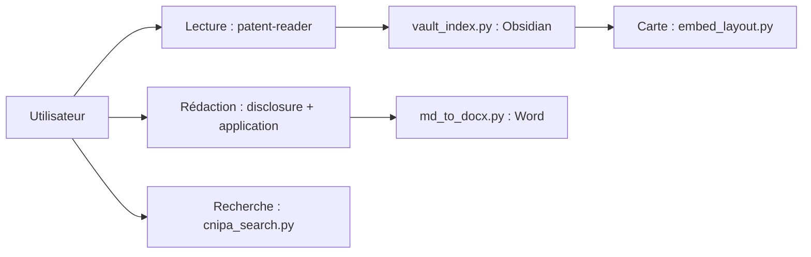

# handsomestWei/patent-disclosure-skill

> Ensemble de skills pour agents : rédiger des brevets chinois, lire des brevets, les cartographier et répondre aux examens.

## Le problème
Un inventeur sait rarement identifier les points brevetables, rédiger la déclaration d'invention ou comprendre un brevet publié.

## Ce que ça fait vraiment
Huit sous-skills : déclaration d'invention (invention, modèle d'utilité, dessin), dossier de demande, séance de dossier, lecture grand public avec archivage Obsidian, carte de brevets, aide à la réponse d'examen, recherche bibliographique CNIPA et bulletin de politique. Les scripts incluent export Word, validation de dossier, plongements et recherche CNIPA.

## Comment c'est branché

## Essayer
Aucune commande d'installation dans ce README : voir « 详细安装说明 » (installation détaillée) cité sans contenu.

## Coût et pièges
Gratuit, mais la recherche s'appuie sur le service CNIPA. La lecture grand public utilise Obsidian en option. Le dépôt date d'avril 2026.

## Ce que ce n'est pas
Pas un conseil juridique : il aide à rédiger, un agent de brevets doit valider. README principalement en chinois, centré sur le droit chinois.

## Alternatives
- Aucune alternative nommée dans le README.

## Pour toi
À surveiller : exemple de collection de skills d'agents sur un domaine métier, utile comme modèle d'organisation, sans usage direct hors brevets chinois.

