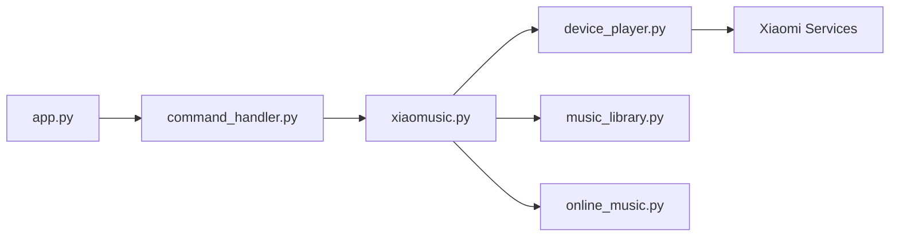

# hanxi/xiaomusic

> Serveur de musique auto-hébergé qui fait jouer des morceaux sur les enceintes Xiaomi Xiao Ai.

## Le problème
Les enceintes Xiaomi ne lisent pas facilement sa musique locale ou en ligne par commande vocale.

## Ce que ça fait vraiment
Serveur FastAPI : commandes vocales (jouer, suivant, boucle, favoris), panneau web, musique locale (mp3, flac, wav…), téléchargement via yt-dlp, listes réseau JSON, plugins JavaScript. Se connecte avec le compte Xiaomi.

## Comment c'est branché


## Essayer
```bash
docker run -p 58090:8090 -v /xiaomusic_music:/app/music -v /xiaomusic_conf:/app/conf hanxi/xiaomusic
pip install -U xiaomusic
xiaomusic
```

## Coût et pièges
Identifiants Xiaomi saisis dans l'interface : le README déconseille l'accès public sans mot de passe et lier un compte à des caméras. Umami et Sentry sont cités parmi les outils.

## Ce que ce n'est pas
Projet archivé : l'auteur ne traite plus issues ni PR, et renvoie vers songloft-org/songloft. README en chinois avec publicités.

## Alternatives
- songloft-org/songloft : relais communautaire cité par le README.

## Pour toi
À ignorer : archivé, hors périmètre data/IA, et il manipule les identifiants d'un compte personnel.

