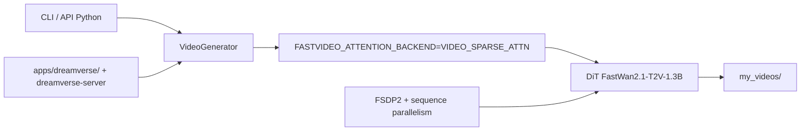

# hao-ai-lab/FastVideo

> Framework unifié de post-entraînement et d'inférence pour la génération vidéo sur GPU.

## Le problème
Générer une vidéo avec un DiT ouvert coûte des minutes de débruitage par clip.
Et chaque recette de distillation ou de finetuning vit dans un dépôt séparé.

## Ce que ça fait vraiment
Post-entraînement complet ou LoRA sur des DiT vidéo, plus une chaîne de prétraitement vidéo/image/texte.
Distillation par étapes (DMD2) et distillation creuse annoncée à plus de 50× d'accélération du débruitage.
Inférence distribuée : parallélisme de séquence, plusieurs backends d'attention, CLI et API Python.
Une application temps réel, Dreamverse, vit dans le monorepo sous `apps/dreamverse/` avec son serveur.

## Comment c'est branché


## Essayer
```bash
uv venv --python 3.12 --seed
source .venv/bin/activate
UV_TORCH_BACKEND=cu126 uv pip install fastvideo
python example.py
```

## Coût et pièges
GPU NVIDIA attendu (H100, A100, 4090) ; sur DGX Spark ARM64 il faut compiler le kernel depuis les sources.
Sur Apple Silicon, chemin séparé MLX/FastMetal ; les poids se téléchargent depuis Hugging Face.

## Ce que ce n'est pas
Pas un modèle : c'est la mécanique autour de modèles tiers qu'il faut télécharger.
Pas un outil sans GPU — la voie CPU n'est pas documentée.
Le monorepo mélange entraînement, inférence et une app produit ; la surface à lire est large.

## Alternatives
SGLang : son inférence diffusion dérive d'un fork de FastVideo, si tu veux seulement servir.

## Pour toi
À regarder seulement si la génération vidéo entre dans ton périmètre ; sinon hors sujet.
