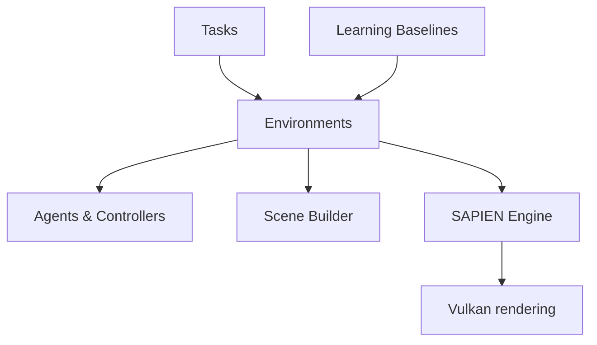

# haosulab/ManiSkill

> Framework de simulation robotique sur GPU (SAPIEN) centré sur la manipulation, avec bases de référence RL et imitation.

## Le problème
Générer beaucoup de données de manipulation robotique et entraîner des politiques exige une simulation parallèle rapide.

## Ce que ça fait vraiment
Simulation et rendu parallélisés sur GPU (plus de 30 000 FPS en RGBD selon le README, sur une 4090), environnements hétérogènes, tâches pour plusieurs robots, API de construction de tâches, environnements real2sim et exemples sim2real. Fournit PPO, SAC, TD-MPC2, Diffusion Policy et des modèles VLA.

## Comment c'est branché


## Essayer
```bash
pip install --upgrade mani_skill
pip install torch
```

## Coût et pièges
Vulkan à configurer soi-même ; GPU NVIDIA pour les performances annoncées (Colab gratuit possible pour essayer). Les chiffres viennent des auteurs.

## Ce que ce n'est pas
Pas un simulateur généraliste de physique : centré sur la manipulation. Le diagramme signale un statut bêta.

## Alternatives
- Aucune alternative nommée dans le README.

## Pour toi
À surveiller : utile pour du RL ou de l'imitation en manipulation ; le notebook Colab permet un essai sans matériel.
