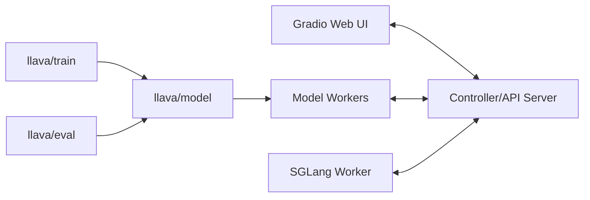

# haotian-liu/LLaVA

> Code d'entraînement, d'évaluation et de service du modèle vision-langage LLaVA.

## Le problème
Construire un assistant multimodal suppose d'aligner un encodeur visuel et un LLM puis de l'instruire sur des données image-texte.

## Ce que ça fait vraiment
Entraînement en deux étapes : alignement (projecteur MLP entre CLIP ViT-L/14 et Vicuna gelés) puis instruction tuning.
Service : controller, serveur Gradio, model workers (4/8 bits, LoRA, multi-GPU) et worker SGLang.
Inférence CLI (`llava.serve.cli`) et évaluation sur 12 benchmarks, dont une évaluation assistée par GPT-4.
Model Zoo de checkpoints v1.5 ; LLaVA-NeXT a son propre dépôt.

## Comment c'est branché


## Essayer
```bash
git clone https://github.com/haotian-liu/LLaVA.git
cd LLaVA
conda create -n llava python=3.10 -y
conda activate llava
pip install -e .
python -m llava.serve.cli --model-path liuhaotian/llava-v1.5-7b --image-file "https://llava-vl.github.io/static/images/view.jpg" --load-4bit
```

## Coût et pièges
Entraînement sur 8×A100 80 Go ; inférence 4 bits < 8 Go. L'évaluation GPT demande une clé OpenAI. Licences des données et des LLM de base à respecter.

## Ce que ce n'est pas
Pas le dernier LLaVA (NeXT ailleurs). Dépôt inactif depuis août 2024. Linux seulement pour l'installation standard.

## Alternatives
- LLaVA-NeXT : successeur plus fort (code séparé).
- Otter, LLaVA-Med : projets voisins cités.

## Pour toi
Surveiller : excellente lecture pour comprendre l'architecture VLM et le fine-tuning LoRA, mais les modèles récents l'ont dépassé pour un usage réel.
