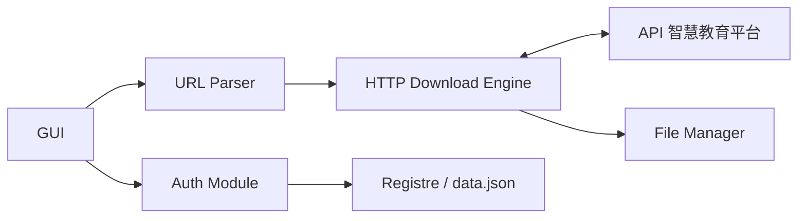

# happycola233/tchMaterial-parser

> Application de bureau qui télécharge en lot les manuels scolaires PDF de la plateforme éducative chinoise.

## Le problème
Les manuels du portail chinois de l'éducation ne se téléchargent qu'un par un depuis le navigateur, sans nom de fichier propre ni signets.

## Ce que ça fait vraiment
On colle une ou plusieurs URL de pages de manuels, l'outil résout les PDF, les nomme d'après le titre du manuel et peut ajouter des signets. Un Access Token du compte peut être saisi (récupéré via un script à coller dans la console du navigateur) ; sans lui, une méthode de repli « non durable » est utilisée. Recherche par niveau/matière/année, mode sombre.

## Comment c'est branché


## Essayer
```bash
winget install happycola233.tchMaterial-parser
yay -S tchmaterial-parser
xattr -cr /path/to/tchMaterial-parser.app
```

## Coût et pièges
Gratuit. Le token expire (environ 7 jours) et vient d'un compte de la plateforme ; il est stocké en local (registre Windows ou `data.json`). Interface graphique obligatoire.

## Ce que ce n'est pas
Pas un outil générique de téléchargement : il ne sert que ce portail, dépend de ses API non officielles et de son bon vouloir. Contenus sous droits, usage personnel et pédagogique uniquement.

## Alternatives
- ChinaTextbook : archive de PDF de manuels déjà téléchargés, cité par le README.

## Pour toi
À ignorer : aucun rapport avec data/IA/MLOps, utile seulement si tu as besoin de manuels scolaires chinois.

