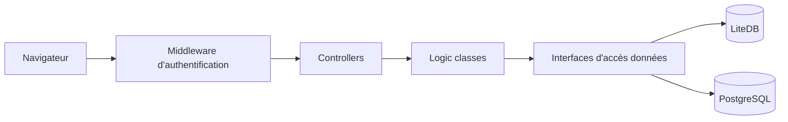

# hargata/lubelog

> Application web auto-hébergée de suivi d'entretien et de consommation de carburant de véhicules.

## Le problème
Les carnets d'entretien sur tableur ou factures en vrac font perdre l'historique et les rappels.

## Ce que ça fait vraiment
Une application ASP.NET Core MVC : enregistrements (carburant, entretien, odomètre, rappels), graphiques, import CSV, envoi d'e-mails de rappel (SMTP), authentification y compris OpenID Connect. Les données sont stockées dans LiteDB (fichier) ou PostgreSQL. Distribuée en image Docker ou exécutable Windows, avec chart Helm fourni par un tiers (Anza-Labs).

## Comment c'est branché

## Essayer
Le README ne fournit aucune commande : il renvoie à un guide de démarrage externe. Une démo en ligne existe (identifiants « test » / « 1234 », remise à zéro toutes les 20 minutes).

## Coût et pièges
Gratuit ; le SMTP est nécessaire pour les rappels par e-mail. Le README est très court, les détails d'installation sont hors dépôt.

## Ce que ce n'est pas
Ce n'est pas un outil de gestion de flotte professionnel ni une solution data : c'est une application personnelle de suivi.

## Alternatives
Aucune alternative nommée dans le README.

## Pour toi
À ignorer : application pour particuliers sans rapport avec un travail data, IA ou MLOps.

