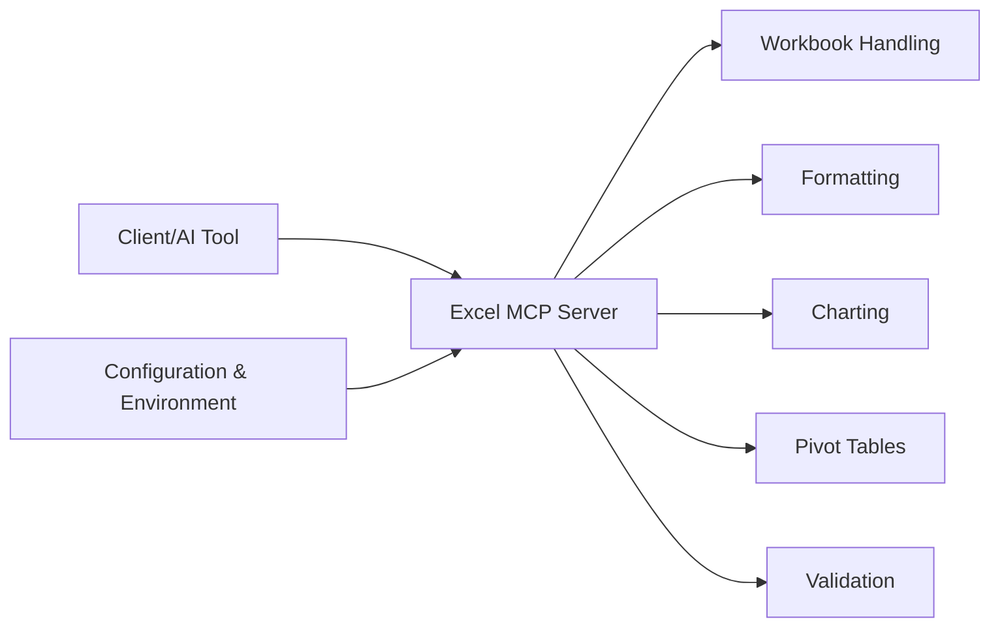

# haris-musa/excel-mcp-server

> Serveur MCP qui laisse un agent créer, lire et modifier des classeurs Excel sans installer Excel.

## Le problème
Un assistant IA sait parler de tableurs mais ne peut pas ouvrir un `.xlsx`. Sans outil, l'humain copie et colle les données.

## Ce que ça fait vraiment
Le serveur expose des outils MCP pour classeurs et feuilles : lecture et écriture de données, formules, mise en forme, tableaux, graphiques, tableaux croisés dynamiques, validation, copie ou suppression de feuilles. Trois transports : stdio (local), SSE (déprécié) et HTTP en flux (`streamable-http`). D'après le code, chaque domaine a son module (`chart.py`, `pivot.py`, `formatting.py`, `validation.py`…) derrière `server.py`.

## Comment c'est branché


## Essayer
```bash
uvx excel-mcp-server stdio
uvx excel-mcp-server streamable-http
EXCEL_FILES_PATH=/path/to/excel_files FASTMCP_PORT=8007 uvx excel-mcp-server streamable-http
```

## Coût et pièges
Gratuit. En SSE ou HTTP, il faut définir `EXCEL_FILES_PATH` côté serveur ; les chemins sont relatifs à ce dossier et les chemins absolus sont rejetés. Le README annonce le port 8017 par défaut mais ses exemples de connexion pointent vers 8000 : régler `FASTMCP_PORT` explicitement.

## Ce que ce n'est pas
Ce n'est pas Excel : pas de recalcul par le moteur Excel, ni de macros. Le README ne précise pas le format de sortie des formules calculées. Le mainteneur est unique et le projet a 73 issues ouvertes.

## Alternatives
Aucune alternative nommée dans le README.

## Pour toi
À adopter pour brancher un agent sur des classeurs de reporting : la mise en place tient en une ligne `uvx`, et le risque se limite au dossier de fichiers que tu désignes.
