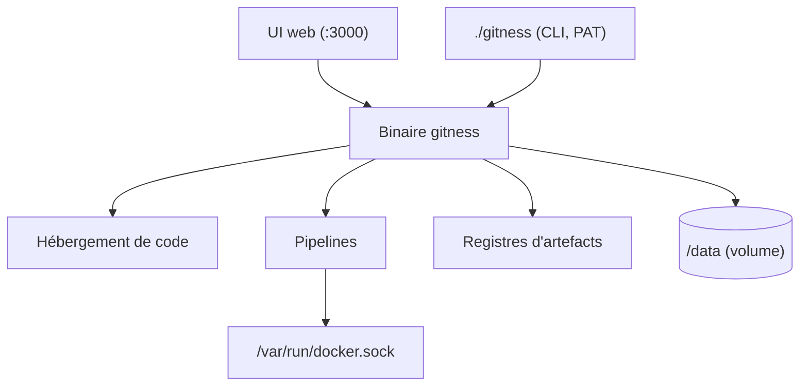

# harness/harness

> Plateforme DevOps open source : hébergement de code, pipelines, Gitspaces et registres.

## Le problème
Assembler forge Git, CI, environnements de développement et registre d'artefacts suppose sinon
quatre produits à intégrer, authentifier et maintenir séparément.

## Ce que ça fait vraiment
Réunit dans un binaire l'hébergement de dépôts, des pipelines DevOps automatisés, des
environnements de développement hébergés (Gitspaces) et des registres d'artefacts.
Les pipelines s'exécutent dans des conteneurs Docker : la version de l'API Docker est négociée
automatiquement avec le démon, ce qui couvre Docker Desktop, Rancher Desktop, Colima et Docker natif.
Expose une interface web sur le port 3000, une spécification Swagger sur `/swagger`, un swagger
séparé pour les registres, et un CLI `gitness` pour créer des jetons d'accès personnels.

## Comment c'est branché


## Essayer
```bash
docker run -d -p 3000:3000 -p 3022:3022 \
  -v /var/run/docker.sock:/var/run/docker.sock \
  -v /tmp/harness:/data --name harness --restart always harness/harness
make dep && make tools
make build
./gitness server .local.env
./gitness login          # user: admin, pw: changeit
```

## Coût et pièges
Gratuit. Le conteneur monte le socket Docker de l'hôte, ce qui donne au service un pouvoir étendu
sur la machine. Sans volume nommé ou bind mount, toutes les données disparaissent à l'arrêt.
Le mot de passe initial est `changeit`. Compiler demande Node, Go ≥ 1.20 et protobuf en v3.21.11
exactement, avec une recette Homebrew épinglée.

## Ce que ce n'est pas
Ce n'est pas Drone, et ne l'égale pas encore : le README annonce la parité des capacités de
pipeline comme un objectif à atteindre, Drone étant figé dans une branche. Ce n'est pas la
plateforme commerciale Harness : c'est l'édition open source. Le CLI est décrit comme « TRÈS basique ».

## Alternatives
- **Drone** : l'ancêtre, gardé en branche `drone`, plus mûr sur les pipelines seuls.

## Pour toi
À surveiller si tu veux une forge et une CI auto-hébergées d'un bloc pour tes projets.
