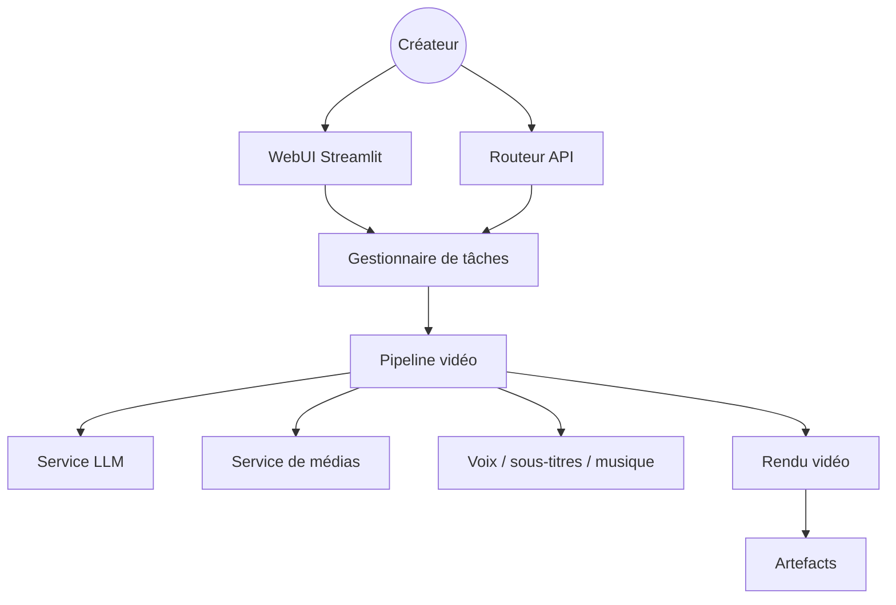

# harry0703/MoneyPrinterTurbo

> Générateur automatique de vidéos courtes à partir d'un sujet, avec script, voix, sous-titres et montage.

## Le problème
Produire une vidéo courte demande script, banque d'images, voix off, sous-titres, musique et montage.
Chaque étape a son outil et son format ; les enchaîner à la main prend des heures.

## Ce que ça fait vraiment
À partir d'un thème, génère le script, en extrait des mots-clés, récupère ou génère les plans, monte le tout.
Quatre points d'entrée : agent IA, WebUI Streamlit, API FastAPI, CLI — avec génération par lots.
Voix via Edge TTS (gratuit, sans clé) ou une dizaine de services cloud ; sous-titres par timestamps TTS ou faster-whisper.
Trois formats de sortie (9:16, 16:9, 1:1) et publication automatique vers TikTok, Instagram, YouTube Shorts.

## Comment c'est branché


## Essayer
```shell
git clone https://github.com/harry0703/MoneyPrinterTurbo.git
cd MoneyPrinterTurbo
docker compose -f docker-compose.release.yml up
uv run python cli.py --video-subject "人工智能如何改变日常生活"
```

## Coût et pièges
Les LLM, les services de voix cloud et la génération vidéo IA sont facturés par les fournisseurs.
Whisper local télécharge 1,6 à 3 Go de modèle ; ffmpeg doit parfois être installé à la main.

## Ce que ce n'est pas
Pas un outil de montage : aucun contrôle fin sur le rythme, les transitions ou la colorimétrie.
Le README est saturé de liens sponsorisés vers des revendeurs d'API — à lire comme de la publicité.
La musique de fond livrée provient de YouTube, avec une mention explicite de retrait en cas de litige.

## Alternatives
- `openai/whisper` : si seule la transcription est nécessaire.

## Pour toi
Hors périmètre data/IA, et la dépendance aux revendeurs d'API cités est un mauvais signal. À ignorer.
