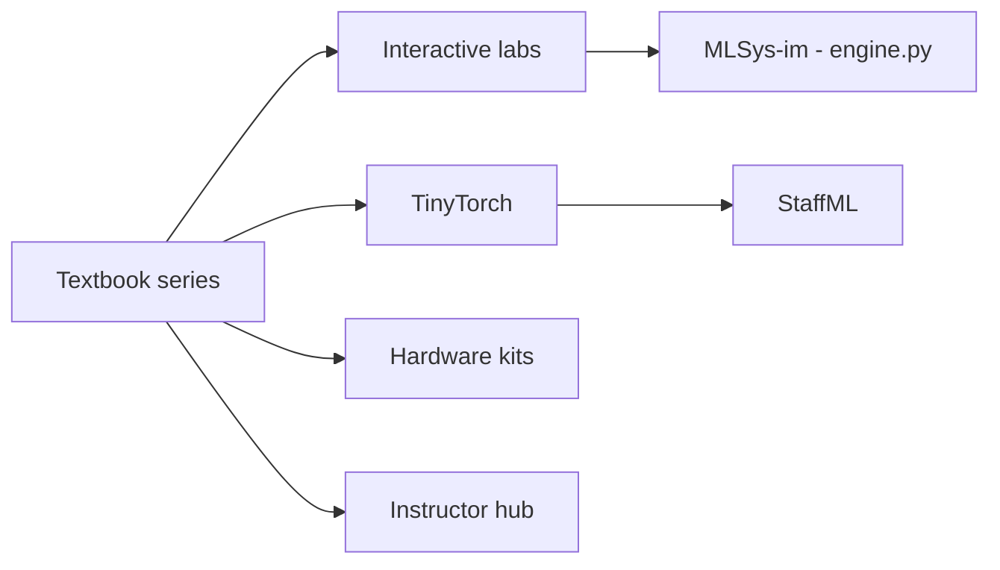

# harvard-edge/cs249r_book

> Manuel libre en plusieurs volumes sur l'ingénierie des systèmes ML, avec labs, TinyTorch et kits matériels.

## Le problème
Les cours de deep learning s'arrêtent au modèle ; peu enseignent l'exécution sur du vrai matériel, à l'échelle et sous contraintes de latence et de puissance.

## Ce que ça fait vraiment
Un curriculum : manuel en quatre volumes (I Fondations, II Passage à l'échelle en préversion, III Agentique et IV IA physique en développement), labs interactifs Marimo, TinyTorch (reconstruire un framework en 20 modules), kits matériels (Arduino, Raspberry Pi…), simulateur MLSys·im, questions d'entretien StaffML, ressources pour enseignants. Lecture gratuite sur mlsysbook.ai.

## Comment c'est branché

## Essayer
Le README ne donne pas de commande ; il oriente vers la lecture en ligne du volume I, le lab 00 et TinyTorch.

## Coût et pièges
Gratuit en ligne. Les volumes III et IV changent vite. Le texte est sous CC BY-NC-SA 4.0 (usage non commercial) ; chaque outil a sa propre licence. Branche `dev` pour le développement actif.

## Ce que ce n'est pas
Pas un cours de MLOps par recettes : le README insiste sur la physique et le raisonnement quantitatif sous les outils. Pas un manuel de deep learning.

## Alternatives
Aucune alternative nommée comme équivalent direct (le README cite des livres de deep learning comme complémentaires).

## Pour toi
À surveiller : excellente lecture pour comprendre mémoire, KV-cache et infrastructures, mais clause non commerciale et volumes encore mouvants.

