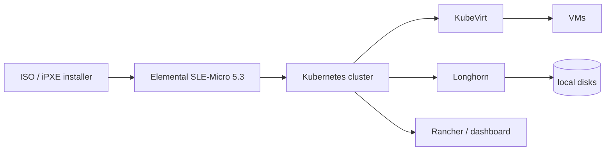

# harvester/harvester

> **One sentence.** A hyperconverged infrastructure platform built on Kubernetes, installed from an ISO onto bare metal servers to run VMs.

## The problem

Running virtual machines on your own hardware usually means a proprietary hypervisor plus an external
SAN, and two separate control planes — one for VMs, one for containers. Harvester targets operators
looking for an open-source, cloud-native HCI option where both VM and container workloads are driven
through the Kubernetes API.

## What it actually does

Harvester ships as a bootable appliance image installed directly on a bare metal server (ISO or iPXE
scripts), forming a cluster to which further compute nodes can be joined. It covers VM lifecycle
management — create, edit, clone, delete, SSH-key injection, cloud-init, graphic and serial port
console — live migration of a VM to another host or node with zero downtime, and backup, snapshot and
restore to NFS, S3 servers or NAS devices, where a backup can restore a failed VM or create a new one
on a different cluster. Storage uses local, direct attached disks instead of external SANs, with
distributed block storage and tiering, exposed as volumes you can create, edit, clone or export.
Networking supports a virtual IP (VIP) and multiple NICs, with VLAN or untagged networks for VMs that
must reach the outside. Through Rancher, it is managed from the Virtualization Management page
alongside Kubernetes clusters.

## How it is wired



No code-derived diagram exists for this repository; the graph above follows the architecture described
in the README. The named building blocks are Longhorn (distributed block storage for Kubernetes),
KubeVirt (VM management add-on for Kubernetes) and Elemental for SLE-Micro 5.3 (an immutable Linux
distribution). The source is split across several repositories listed in the README:
`harvester/dashboard`, `harvester/harvester-installer`, `harvester/harvester-network-controller`,
`harvester/cloud-provider-harvester`, `harvester/load-balancer-harvester`,
`harvester/harvester-csi-driver` and `harvester/terraform-provider-harvester`.

## Trying it

The README documents no install command: you download the ISO from the GitHub releases, boot it and
follow the installer (default user `rancher`, "Create a new Harvester cluster" or "Join an existing
Harvester cluster", installation disk and data disk, bonded NIC `mgmt-bo`, VIP, cluster token, NTP
servers). The only documented command-line parameter disables the hardware check during an iPXE test
installation:

```
harvester.install.skipchecks=true
```

The web interface then lives at `https://your-virtual-ip`, with an `admin` password set on first login.

## Cost and gotchas

The software is free and Apache 2.0; the cost is hardware. The stated minimum: x86_64 with
hardware-assisted virtualization, 8 cores for testing and 16+ for production, 32 GB RAM minimum and
64 GB+ for production, 250 GB disk for testing (180 GB with multiple disks) and 500 GB+ for
production, 5,000+ random IOPS per SSD/NVMe disk — the first three management nodes must be fast
enough for etcd — 1 Gbps Ethernet for testing and 10 Gbps for production, plus a switch with port
trunking for VLAN support. The README recommends server-class hardware and states that laptops and
nested virtualization are not officially supported. The release table marks branches 1.1 through 1.4
as EOL: no further code-level maintenance on those.

## What it is not

It is not something installed next to other software: it takes over the whole server, installation
disk included. It is not a desktop hypervisor — laptops and nested virtualization are out of support.
It is not a hosted service: hardware, network and switching are yours to provide, including the VLAN,
trunking and VIP setup. And this repository holds only part of the product — installer, dashboard,
network controller, CSI driver and Terraform provider live in separate repositories.

## Alternatives

- `k3s-io/k3s` and `kubernetes/minikube` are Kubernetes distributions: they give you a container
  control plane, not VM virtualization or distributed block storage — preferable when you have no VMs
  to host.
- `etcd-io/etcd` and `seaweedfs/seaweedfs` are components (consensus, object storage) rather than HCI
  platforms; neither is comparable to Harvester at equal scope.
- The genuinely related projects named in the README are Longhorn and KubeVirt, but they are parts of
  Harvester, not substitutes for it.

## Why it matters to you

Indirect interest for a data / AI / MLOps profile: this is the substrate under on-premise VMs and
Kubernetes clusters, not a link in the ML chain. Worth watching if you must self-host GPU workloads or
isolated environments on your own hardware; skip it if your compute already lives with a cloud
provider or on an existing Kubernetes cluster.
