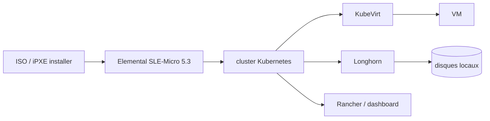

# harvester/harvester

> **Une phrase.** Une infrastructure hyperconvergée bâtie sur Kubernetes, installée par ISO sur des serveurs bare metal, pour faire tourner des VM.

## Le problème

Faire tourner des machines virtuelles sur son propre matériel suppose d'ordinaire un hyperviseur
propriétaire et un SAN externe, avec deux plans de gestion distincts : un pour les VM, un pour les
conteneurs. Harvester répond au besoin d'opérateurs qui cherchent une alternative open source et
cloud-native, pilotant VM et conteneurs par la même API Kubernetes.

## Ce que ça fait vraiment

Harvester s'installe comme une image d'appliance amorçable (ISO ou scripts iPXE) directement sur un
serveur bare metal, et forme un cluster auquel on ajoute des nœuds de calcul. Il gère le cycle de vie
des VM : création, édition, clonage, suppression, injection de clé SSH, cloud-init, console graphique
et port série. Il fait de la migration à chaud d'une VM vers un autre nœud sans interruption, de la
sauvegarde / snapshot / restauration vers NFS, S3 ou NAS — une sauvegarde pouvant servir à recréer une
VM sur un autre cluster. Côté stockage, il utilise les disques locaux en attachement direct plutôt
qu'un SAN, avec du stockage bloc distribué et du tiering, et expose des volumes créables, éditables,
clonables, exportables. Côté réseau, il prend en charge une IP virtuelle (VIP), plusieurs cartes
réseau, des réseaux VLAN ou non taggés. Intégré à Rancher, il se pilote depuis la page Virtualization
Management aux côtés des clusters Kubernetes.

## Comment c'est branché



Aucun diagramme tiré du code n'existe pour ce dépôt ; ce schéma reprend l'architecture décrite dans le
README. Les briques citées y sont nommées : Longhorn pour le stockage bloc distribué, KubeVirt comme
add-on de gestion de VM pour Kubernetes, Elemental pour SLE-Micro 5.3 comme distribution Linux
immuable. Le code est éclaté sur plusieurs dépôts listés dans le README : `harvester/dashboard`,
`harvester/harvester-installer`, `harvester/harvester-network-controller`,
`harvester/cloud-provider-harvester`, `harvester/load-balancer-harvester`,
`harvester/harvester-csi-driver`, `harvester/terraform-provider-harvester`.

## Essayer

Le README ne documente aucune commande d'installation : on télécharge l'ISO depuis les releases
GitHub, on l'amorce et on suit l'installateur (mot de passe `rancher`, choix « Create a new Harvester
cluster » ou « Join an existing Harvester cluster », disque d'installation et disque de données, NIC
bondée `mgmt-bo`, VIP, token de cluster, serveurs NTP). Seul paramètre en ligne documenté, pour
désactiver la vérification matérielle lors d'une installation iPXE de test :

```
harvester.install.skipchecks=true
```

L'interface web est ensuite sur `https://your-virtual-ip`, avec un mot de passe `admin` à définir à la
première connexion.

## Coût et pièges

Le logiciel est gratuit et sous Apache 2.0, le coût est matériel. Minimum annoncé : x86_64 avec
virtualisation assistée, 8 cœurs pour un test et 16+ en production, 32 Go de RAM au minimum et 64 Go+
en production, 250 Go de disque (180 Go avec plusieurs disques) et 500 Go+ en production, 5 000+ IOPS
aléatoires par disque en SSD/NVMe — les trois premiers nœuds doivent être assez rapides pour etcd —
1 Gbps de réseau pour un test et 10 Gbps en production, et un switch capable de trunker les ports pour
le VLAN. Le README recommande du matériel de classe serveur et indique que les portables et la
virtualisation imbriquée ne sont pas officiellement pris en charge. Le tableau des releases classe les
branches 1.1 à 1.4 en EOL : sur une installation ancienne, plus aucune maintenance au niveau du code.

## Ce que ce n'est pas

Ce n'est pas un outil qu'on installe à côté d'autre chose : c'est le système qui prend le serveur
entier, disque d'installation compris. Ce n'est pas non plus un hyperviseur pour poste de travail —
laptops et virtualisation imbriquée sont hors support. Ce n'est pas un service hébergé : rien n'est
fourni côté matériel, réseau ou switch, et la partie réseau (VLAN, trunking, VIP) reste à votre
charge. Enfin le dépôt ne contient qu'une partie du produit : installateur, dashboard, contrôleur
réseau, driver CSI et provider Terraform vivent dans des dépôts séparés.

## Alternatives

- `k3s-io/k3s` et `kubernetes/minikube` sont des distributions Kubernetes : elles donnent le plan de
  contrôle conteneurs, pas la virtualisation de VM ni le stockage bloc distribué — à préférer si vous
  n'avez pas de VM à héberger.
- `etcd-io/etcd` et `seaweedfs/seaweedfs` sont des briques (consensus, stockage objet) et non des
  plateformes HCI ; aucune n'est comparable à Harvester à périmètre égal.
- Les projets réellement complémentaires cités par le README sont Longhorn et KubeVirt, mais ce sont
  des composants de Harvester, pas des substituts.

## Pour toi

Intérêt indirect pour un profil data / IA / MLOps : c'est le socle sur lequel poser des VM et un
cluster Kubernetes on-premise, pas un outil de la chaîne ML. À surveiller si vous devez héberger vous-même
des charges GPU ou des environnements isolés sur du matériel maison ; à ignorer si votre calcul vit
déjà chez un fournisseur cloud ou sur un cluster Kubernetes existant.
