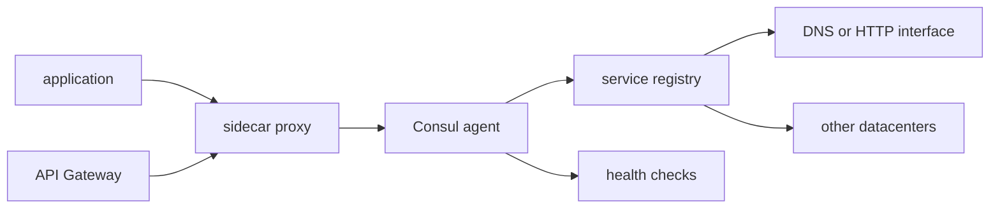

# hashicorp/consul

> **Service registry and network mesh for applications spread across multiple datacenters.**

## The problem

Without it, every service hardcodes where to reach the others, and nothing says whether they
are alive. The README describes a "dynamic, distributed" infrastructure where addresses move
and where encryption between services is wired by hand, datacenter by datacenter.

## What it actually does

Consul keeps a registry where services register themselves and discover others through a DNS
or HTTP interface; external services, including SaaS providers, can be registered too. It runs
health checks that alert operators and keep traffic away from unhealthy hosts, with
service-level circuit breakers. Its Service Mesh sets up TLS connections between services via
sidecar proxies, with identity-based authorization and Transparent Proxy, plus an API Gateway
for traffic and authorization policies at the mesh edge. It also exposes an HTTP API storing
indexed objects for configuration parameters and application metadata. It is built to be
datacenter aware and claims support for any number of regions.

## How it is wired



The README names no source file, so this diagram is inferred from the feature list alone. An
application goes through a sidecar proxy that talks to Consul; the registry is queried over DNS
or HTTP, health checks keep it current, the API Gateway filters mesh ingress, and the registry
is replicated across datacenters. An optional browser-based UI is mentioned, along with a
binary running on Linux, macOS, FreeBSD, Solaris and Windows.

## Trying it

```bash
# No install command is written in the README.
# It only points to external guides:
#   standalone binary : https://learn.hashicorp.com/collections/consul/get-started-vms
#   Minikube          : https://learn.hashicorp.com/tutorials/consul/kubernetes-minikube
#   Kind              : https://learn.hashicorp.com/tutorials/consul/kubernetes-kind
#   Kubernetes        : https://learn.hashicorp.com/tutorials/consul/kubernetes-deployment-guide
```

Nothing is reconstructed here: full documentation lives on the HashiCorp website.

## Cost and traps

The README badge states a BUSL-1.1 license, and the GitHub API reports `NOASSERTION`: this is
not permissive open source, competing uses are restricted, and it should be checked before any
commercial deployment. A commercial edition, Consul Enterprise, exists alongside the free one,
so some capabilities sit behind a contract. The README gives no figures for RAM, node count or
running cost, and does not document the operational burden of a multi-datacenter cluster.

## What it is not

It is not a container orchestrator: Consul neither launches nor schedules workloads, it
registers and routes them. It is not a database — the indexed object store is meant for
configuration, not application data. And the free build is not equivalent to Consul Enterprise,
a gap the README mentions without detailing.

## Alternatives

- `etcd-io/etcd`: if the need is only a consistent key-value store for configuration and leader
  election, without a mesh or built-in health checks.
- `k3s-io/k3s`: if the real question is orchestrating the workloads themselves, Kubernetes
  already ships service discovery and health probes.
- `kubernetes/minikube`: for local trials only — Consul's README cites it as an install target,
  not as a competitor.

## For you

Useful if your model-serving services live across several datacenters or clusters and you want
one registry with TLS between services. On a single Kubernetes cluster, native discovery is
often enough, and the BUSL license deserves a read before any commercial use.
