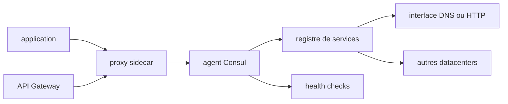

# hashicorp/consul

> **Annuaire de services et maillage réseau pour infrastructures réparties sur plusieurs datacenters.**

## Le problème

Sans lui, chaque service doit savoir en dur où joindre les autres, et rien ne dit qu'ils sont
en bonne santé. Le README décrit une infrastructure « dynamique, distribuée » où les adresses
bougent et où le chiffrement entre services se câble à la main, datacenter par datacenter.

## Ce que ça fait vraiment

Consul tient un registre où les services s'enregistrent eux-mêmes et se découvrent via une
interface DNS ou HTTP ; des services externes, y compris des fournisseurs SaaS, peuvent y être
inscrits. Il exécute des health checks qui alertent l'opérateur et évitent de router du trafic
vers un hôte malade, avec des coupe-circuits au niveau service. Son Service Mesh met en place
des connexions TLS entre services via des proxys sidecar, avec autorisation basée sur
l'identité et Transparent Proxy, et une API Gateway pour les règles de trafic et
d'autorisation en entrée du mesh. Il expose aussi une API HTTP de stockage d'objets indexés
pour la configuration applicative et les métadonnées. Il est conçu « datacenter aware » et
annonce supporter un nombre quelconque de régions.

## Comment c'est branché



Le README ne nomme aucun fichier du code : ce schéma est déduit de la seule liste de
fonctionnalités. Une application passe par un proxy sidecar qui parle à Consul ; le registre
est interrogeable en DNS ou en HTTP, les health checks le tiennent à jour, l'API Gateway filtre
l'entrée du mesh, et le registre est répliqué entre datacenters. Une UI navigateur optionnelle
est mentionnée, ainsi qu'un binaire tournant sur Linux, macOS, FreeBSD, Solaris et Windows.

## Essayer

```bash
# Aucune commande d'installation n'est écrite dans le README.
# Il renvoie uniquement vers des guides externes :
#   binaire autonome : https://learn.hashicorp.com/collections/consul/get-started-vms
#   Minikube         : https://learn.hashicorp.com/tutorials/consul/kubernetes-minikube
#   Kind             : https://learn.hashicorp.com/tutorials/consul/kubernetes-kind
#   Kubernetes       : https://learn.hashicorp.com/tutorials/consul/kubernetes-deployment-guide
```

Rien n'est reconstruit ici : la documentation complète est renvoyée sur le site HashiCorp.

## Coût et pièges

Le badge du README annonce une licence BUSL-1.1, et l'API GitHub la classe `NOASSERTION` :
ce n'est pas de l'open source permissif, les usages concurrents sont restreints — à vérifier
avant tout déploiement commercial. Une version commerciale, Consul Enterprise, existe à côté
de la version libre, donc certaines fonctions sont derrière un contrat. Le README ne chiffre
ni RAM, ni nombre de nœuds, ni coût d'exploitation ; il ne documente pas non plus la charge
opérationnelle réelle d'un cluster multi-datacenter.

## Ce que ce n'est pas

Ce n'est pas un orchestrateur de conteneurs : Consul ne lance ni ne planifie de charges, il
les enregistre et les route. Ce n'est pas une base de données — le stockage d'objets indexés
sert à de la configuration, pas à des données applicatives. Et le mode gratuit n'est pas
équivalent à Consul Enterprise, ce que le README mentionne sans détailler l'écart.

## Alternatives

- `etcd-io/etcd` : si le besoin se limite à un magasin clé-valeur cohérent pour de la
  configuration et de l'élection de leader, sans mesh ni health checks intégrés.
- `k3s-io/k3s` : si la vraie question est d'orchestrer les charges elles-mêmes plutôt que de
  les découvrir, Kubernetes embarque déjà découverte de services et sondes de santé.
- `kubernetes/minikube` : uniquement pour essayer localement — le README de Consul le cite
  d'ailleurs comme cible d'installation, pas comme concurrent.

## Pour toi

Utile si tes services de modèles vivent sur plusieurs datacenters ou clusters et que tu veux
un annuaire unique avec TLS entre services. Sur un cluster Kubernetes unique, la découverte
native suffit souvent, et la licence BUSL mérite une lecture avant tout usage commercial.
