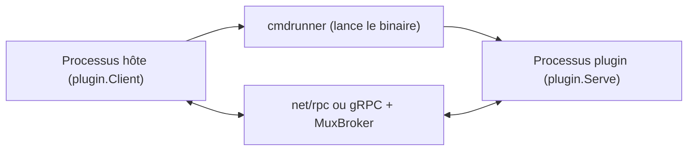

# hashicorp/go-plugin

> Système de plugins pour Go, via sous-processus et RPC, utilisé par Terraform, Vault, Nomad, Packer.

## Le problème
Charger du code tiers dans un même processus le fait planter avec lui ; la bibliothèque `plugin` de Go a de fortes limites.

## Ce que ça fait vraiment
L'hôte lance le plugin en sous-processus et communique par net/rpc ou gRPC (donc plugins en n'importe quel langage). Le plugin implémente une interface Go comme s'il était local. Gère arguments complexes (MuxBroker), appels dans les deux sens, journalisation, synchronisation stdout/stderr, TTY, versions de protocole, réattachement, vérification de somme de contrôle et TLS.

## Comment c'est branché

## Essayer
Aucune commande documentée : le README décrit cinq étapes (interface, client/serveur RPC, `Plugin`, `plugin.Serve`, `plugin.Client`) et renvoie au dossier `examples/`.

## Coût et pièges
Gratuit, MPL-2.0. Conçu pour un réseau local fiable uniquement. Écrire les implémentations client et serveur d'interface est fastidieux.

## Ce que ce n'est pas
Pas une architecture de plugins sur réseau distant. Plus lent que des bibliothèques partagées.

## Alternatives
- Le paquet standard `plugin` de Go : plus rapide, mais avec de nombreuses limites.

## Pour toi
À surveiller : utile si tu écris des outils MLOps en Go avec extensions tierces ; hors sujet si tu restes en Python.

