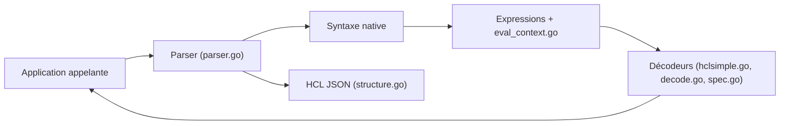

# hashicorp/hcl

> Bibliothèque Go pour définir des langages de configuration lisibles par humains et machines, utilisée par des outils DevOps.

## Le problème
JSON et YAML sérialisent des données mais ne sont pas conçus comme langage de configuration : peu lisibles, sans expressions ni bons messages d'erreur.

## Ce que ça fait vraiment
L'application déclare les attributs et blocs attendus ; HCL analyse le fichier (syntaxe native ou variante JSON équivalente), vérifie la structure et renvoie des objets exploitables. Il gère expressions, interpolation, variables et fonctions fournies par l'appelant. Des décodeurs remplissent des structs Go (`hclsimple.DecodeFile`) ou des valeurs dynamiques ; extensions : blocs dynamiques, fonctions utilisateur, écriture et formatage préservant la source. La version 2 est incompatible avec la 1.

## Comment c'est branché


## Essayer
```bash
# Exemple Go du README (hclsimple), fichier config.hcl :
# err := hclsimple.DecodeFile("config.hcl", nil, &config)
```

## Coût et pièges
Gratuit, import via Go Modules uniquement. Licence MPL-2.0 : copyleft de fichier à connaître. Pas de chemin de migration de HCL 1 vers 2.

## Ce que ce n'est pas
Pas un outil final : il faut une application Go qui l'embarque (c'est ce que fait Terraform, hors README). Pas un format d'échange universel type JSON.

## Alternatives
JSON, YAML (comparés dans la section « Why? » du README).

## Pour toi
Utile seulement si tu écris des outils Go avec configuration riche ; pour de la data/IA en Python il n'apporte rien directement, mais comprendre HCL aide à lire les configurations d'infra.

