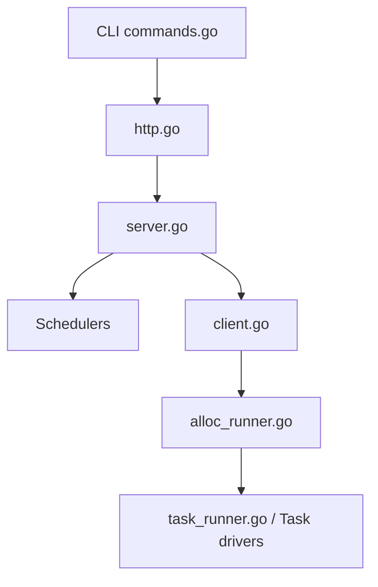

# hashicorp/nomad

> Orchestrateur en un seul binaire pour conteneurs, binaires et VM, sur site ou dans le cloud.

## Le problème
Kubernetes est lourd à exploiter, surtout quand il faut faire tourner ensemble des conteneurs, des applications anciennes et des batchs.

## Ce que ça fait vraiment
Un seul binaire regroupe l'ordonnancement et la gestion des ressources, sans stockage externe.
Des drivers de tâches prennent en charge Docker, Podman, les exécutables, Java et QEMU.
Des plugins de périphériques gèrent GPU, FPGA et TPU. La fédération couvre plusieurs régions.
Il s'intègre avec Consul et Vault.

## Comment c'est branché

## Essayer
Le README ne donne aucune commande et renvoie vers les tutoriels Getting Started.

## Coût et pièges
Une version Nomad Enterprise existe et elle est payante. GitHub n'identifie pas la licence, à vérifier avant tout usage commercial.

## Ce que ce n'est pas
Ce n'est pas un outil MLOps : il orchestre, il ne suit ni les expériences ni les modèles. La documentation se trouve dans un autre dépôt (`web-unified-docs`).

## Alternatives
Le README ne nomme aucun dépôt alternatif.

## Pour toi
À ignorer : c'est de l'infrastructure généraliste. Utile seulement si ton équipe cherche une alternative légère à Kubernetes pour des batchs GPU.
