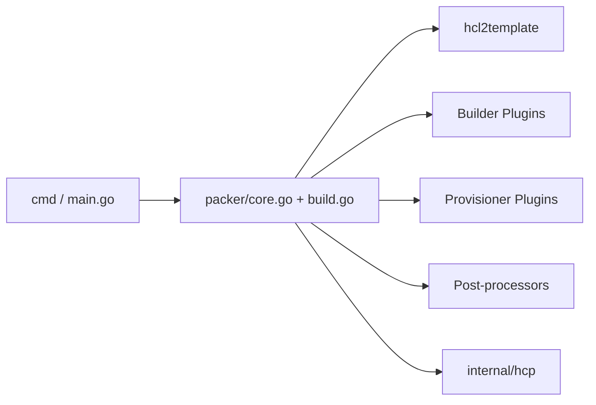

# hashicorp/packer

> Outil qui construit des images de machines identiques pour plusieurs plateformes à partir d'une seule configuration.

## Le problème
Des images de machines montées à la main ou différemment par plateforme dérivent et ne se reproduisent pas.

## Ce que ça fait vraiment
Un binaire Go qui lit un modèle (HCL) et déclenche en parallèle des constructeurs (builders), provisionneurs, sources de données et post-processeurs, fournis en plugins externes téléchargés par un « plugin getter ». Une intégration HCP Packer enregistre les métadonnées d'images. Les images peuvent devenir des boîtes Vagrant.

## Comment c'est branché

## Essayer
Aucune commande dans le README : renvoi vers les guides Docker et AWS de la documentation.

## Coût et pièges
Les plateformes cibles (AWS, etc.) facturent à ta charge. Licence présente mais non identifiée par GitHub. Certains plugins communautaires sont non maintenus ou archivés.

## Ce que ce n'est pas
Ce n'est pas un orchestrateur de déploiement : il fabrique des images. HCP Packer est un service séparé.

## Alternatives
Aucune alternative nommée dans le README (Terraform est mentionné comme consommateur des métadonnées HCP).

## Pour toi
À surveiller : utile pour figer des images GPU ou d'entraînement reproductibles, sous réserve de vérifier la licence.

