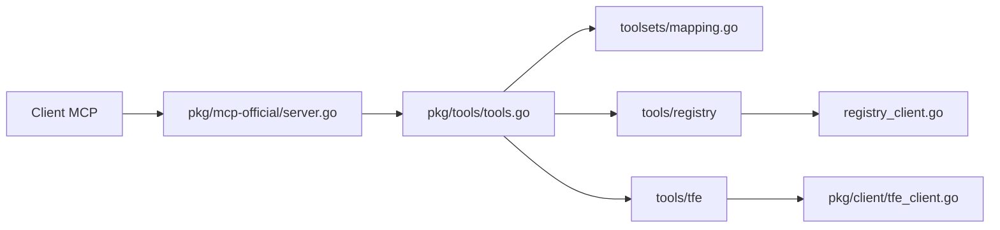

# hashicorp/terraform-mcp-server

> Serveur MCP officiel reliant un assistant IA au registre Terraform et à HCP Terraform, pour les équipes IaC.

## Le problème
Un assistant qui écrit du Terraform invente des providers ou des versions faute d'accès au registre, et ne voit pas tes workspaces.

## Ce que ça fait vraiment
Serveur Go en stdio ou Streamable HTTP, avec deux familles d'outils : registre public (recherche de providers, modules, politiques, dernières versions) et HCP Terraform / Terraform Enterprise (organisations, projets, workspaces, variables, runs). Les opérations qui modifient l'état exigent `ENABLE_TF_OPERATIONS`. En mode HTTP : TLS, CORS, limites de débit, liste d'organisations autorisées, jeton par utilisateur, métriques OpenTelemetry.

## Comment c'est branché


## Essayer
```bash
claude mcp add terraform -s user -t stdio -- docker run -i --rm hashicorp/terraform-mcp-server
docker run -p 8080:8080 --rm -e TRANSPORT_MODE=streamable-http -e TRANSPORT_HOST=0.0.0.0 hashicorp/terraform-mcp-server
```

## Coût et pièges
Gratuit ; un jeton `TFE_TOKEN` n'est utile que pour HCP/TFE. Selon la requête, des données Terraform sont exposées au LLM : le README interdit de l'utiliser avec un client non fiable. Licence MPL-2.0, copyleft faible au niveau du fichier.

## Ce que ce n'est pas
Pas une garantie de conformité : les sorties sont générées dynamiquement et à relire. Les outils de modification sont éteints par défaut.

## Alternatives
Aucune alternative nommée dans le README.

## Pour toi
À adopter : éditeur de l'outil, options de sécurité documentées et opérations d'écriture désactivées par défaut, utile pour de l'IaC MLOps.
