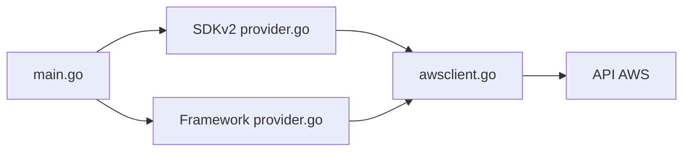

# hashicorp/terraform-provider-aws

> Fournisseur Terraform qui gère les ressources AWS, pour les équipes d'infrastructure.

## Le problème
Décrire et versionner l'infrastructure AWS en code plutôt que par la console.

## Ce que ça fait vraiment
README minimal (moins de 800 caractères) : il ne fait que lister le guide de contribution, la feuille de route trimestrielle, la FAQ et les tutoriels. D'après le code, le fournisseur route les requêtes vers des paquets de service (SDKv2 et Plugin Framework) qui appellent les API AWS.

## Comment c'est branché

## Essayer
Aucune commande documentée dans le README.

## Coût et pièges
Les ressources AWS créées sont facturées par AWS. 3 577 issues ouvertes.

## Ce que ce n'est pas
Pas un outil autonome : il exige Terraform et un compte AWS. Le README ne documente ni installation ni usage.

## Alternatives
Aucune alternative nommée dans le README.

## Pour toi
À adopter pour provisionner du MLOps sur AWS (MPL-2.0, maintenu par HashiCorp), mais le README ne dit rien : il faut lire la documentation Terraform.

