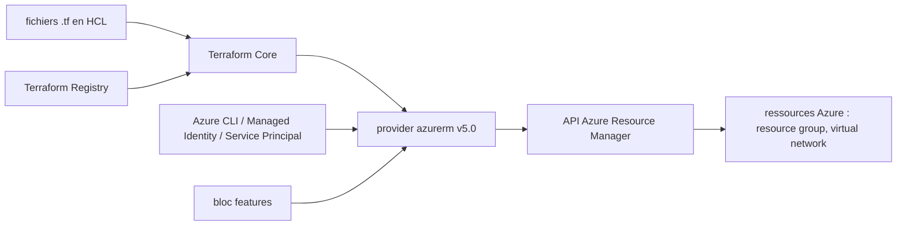

# hashicorp/terraform-provider-azurerm

> **The Terraform plugin that drives Azure Resource Manager, for anyone describing Azure infrastructure as code.**

## The problem

Creating and evolving Azure resources by hand in the portal or through CLI scripts leaves no
reproducible trace and no change plan. The README does not spell this out: it only states
that the provider "allows managing resources within Azure Resource Manager".

## What it actually does

The repository ships a Terraform provider, the bridge between HCL and the Azure Resource
Manager API. It exposes resource types (`azurerm_resource_group`, `azurerm_virtual_network`,
and so on) declared in a `.tf` file, plus a `provider "azurerm"` block with a mandatory
`features {}` block that tunes its behaviour. Authentication, per the README, goes through
the Azure CLI, a Managed Identity or a Service Principal. It does not plan or apply anything
itself: Terraform Core drives, the provider translates into ARM calls. The documented version
here is 5.0, to be used with the latest Terraform Core.

## How it is wired



The README shows this chain by example: you pin the provider version through
`required_providers` (source `hashicorp/azurerm`), Terraform Core fetches it from the
Registry, configures it with `features {}` and credentials, then each `resource` block is
turned into ARM calls. Internal file names are unknown: no code-derived diagram ships with
this sheet.

## Trying it

The README gives no shell command, only an HCL manifest to copy:

```hcl
terraform {
  required_providers {
    azurerm = {
      source = "hashicorp/azurerm"
      version = "=5.0.0"
    }
  }
}

provider "azurerm" {
  features {}
}

resource "azurerm_resource_group" "example" {
  name     = "example-resources"
  location = "West Europe"
}
```

For developing the provider itself, the README points to `DEVELOPER.md` and the
`/contributing` directory without restating the commands.

## Cost and traps

The code is free, but everything it creates is billed by Azure: you need an active Azure
subscription, hence an account to create and an invoice of your own. You also need
credentials (a logged-in Azure CLI, a Managed Identity or a Service Principal) and Terraform
Core installed separately. The README insists on pinning the version (`version = "=5.0.0"`)
and on using the latest Terraform Core with 5.0: a mismatch between the two is the stated
trap. The MPL-2.0 licence is a file-level copyleft, worth checking before forking.

## What it is not

It is not Terraform: without Terraform Core installed, this repository does nothing. It is
not a cost estimation or governance tool either, nor a compliance scanner — it creates
resources, it does not judge what they cost or whether they are safe. And it is not a
multi-cloud layer: it only talks to Azure Resource Manager, each cloud having its own
provider.

## Alternatives

- `hashicorp/terraform-provider-aws`: the same model for AWS, pick it if the infrastructure lives there.
- `databricks/terraform-provider-databricks`: a Databricks-specific provider, complementary rather than competing when deploying a workspace on top of Azure.
- `bridgecrewio/checkov` and `infracost/infracost` do not replace this provider: they analyse Terraform code (security, cost) instead of applying it.

## For you

As soon as a data or ML platform runs on Azure (storage, networking, clusters, Azure ML),
this provider is what makes the environment reproducible. Adopt it if the target cloud is
Azure, ignore it otherwise: it brings nothing outside that ecosystem.
