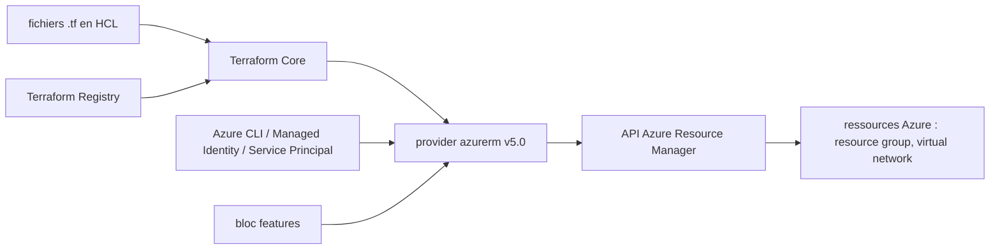

# hashicorp/terraform-provider-azurerm

> **Le plugin Terraform qui pilote Azure Resource Manager, pour qui décrit son infra Azure en code.**

## Le problème

Créer et faire évoluer des ressources Azure à la main dans le portail ou en scripts CLI ne
laisse ni trace reproductible ni plan de changement. Le README ne détaille pas ce constat :
il pose simplement que le provider « allows managing resources within Azure Resource Manager ».

## Ce que ça fait vraiment

Le dépôt fournit un provider Terraform, c'est-à-dire le pont entre le langage HCL et l'API
Azure Resource Manager. Il expose des types de ressources (`azurerm_resource_group`,
`azurerm_virtual_network`, etc.) qu'on déclare dans un fichier `.tf`, et un bloc `provider
"azurerm"` avec un bloc `features {}` obligatoire qui module son comportement.
L'authentification passe, d'après le README, par l'Azure CLI, une Managed Identity ou un
Service Principal. Il ne fait pas lui-même le plan ni l'application : c'est Terraform Core
qui pilote, le provider se contente de traduire en appels ARM. La version documentée ici est
la 5.0, à utiliser avec la dernière version de Terraform Core.

## Comment c'est branché



Le README décrit ce chaînage par l'exemple : on épingle la version du provider via
`required_providers` (source `hashicorp/azurerm`), Terraform Core le télécharge depuis le
Registry, le configure avec le bloc `features {}` et les identifiants, puis chaque bloc
`resource` est traduit en appels ARM. Les vrais noms de fichiers internes ne sont pas
connus : aucun diagramme tiré du code n'accompagne cette fiche.

## Essayer

Le README ne donne aucune commande shell, seulement un manifeste HCL à recopier :

```hcl
terraform {
  required_providers {
    azurerm = {
      source = "hashicorp/azurerm"
      version = "=5.0.0"
    }
  }
}

provider "azurerm" {
  features {}
}

resource "azurerm_resource_group" "example" {
  name     = "example-resources"
  location = "West Europe"
}
```

Pour le développement du provider lui-même, le README renvoie à `DEVELOPER.md` et au
répertoire `/contributing`, sans reprendre les commandes ici.

## Coût et pièges

Le code est gratuit, mais tout ce qu'il crée est facturé par Azure : il faut un abonnement
Azure actif, donc un compte à créer et une facture à sa charge. Il faut aussi des
identifiants (Azure CLI connectée, Managed Identity ou Service Principal) et Terraform Core
installé à part. Le README insiste sur l'épinglage de version (`version = "=5.0.0"`) et sur
l'usage de la dernière version de Terraform Core avec la 5.0 : un décalage entre les deux est
le piège annoncé. La licence MPL-2.0 est un copyleft de fichier, à vérifier avant de forker.

## Ce que ce n'est pas

Ce n'est pas Terraform : sans Terraform Core installé, ce dépôt ne fait rien. Ce n'est pas
non plus un outil d'estimation ou de contrôle de coûts, ni un scanner de conformité — il
crée les ressources, il ne juge pas ce qu'elles coûtent ni si elles sont sûres. Enfin ce
n'est pas une couche multi-cloud : il ne parle qu'à Azure Resource Manager, chaque cloud
ayant son propre provider.

## Alternatives

- `hashicorp/terraform-provider-aws` : le même modèle pour AWS, à choisir si l'infra est sur AWS.
- `databricks/terraform-provider-databricks` : provider dédié à Databricks, complémentaire plutôt que concurrent quand on déploie un workspace au-dessus d'Azure.
- `bridgecrewio/checkov` et `infracost/infracost` ne remplacent pas ce provider : ils analysent le code Terraform (sécurité, coût) au lieu de l'appliquer.

## Pour toi

Dès qu'une plateforme data ou ML tourne sur Azure (stockage, réseau, clusters, Azure ML),
c'est par ce provider que passe la reproductibilité de l'environnement. À adopter si le cloud
cible est Azure, à ignorer sinon : il n'apporte rien hors de cet écosystème.
