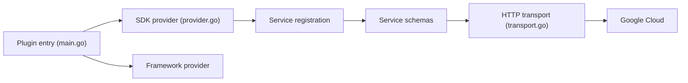

# hashicorp/terraform-provider-google

> Plugin Terraform officiel pour gérer les ressources Google Cloud, pour équipes d'infrastructure.

## Le problème
Décrire et versionner l'infrastructure Google Cloud en code plutôt que par la console.

## Ce que ça fait vraiment
Le provider enregistre les schémas de ressources et sources de données par service et les appelle via un transport HTTP commun. Il couvre les fonctionnalités en disponibilité générale ; le provider `google-beta` couvre les préversions. Il est maintenu conjointement par les équipes Terraform de Google et de HashiCorp. Le dépôt est généré depuis magic-modules : les modifications directes sont écrasées.

## Comment c'est branché


## Essayer
```bash
terraform init -upgrade
```

## Coût et pièges
Le provider est gratuit ; les ressources créées sur Google Cloud sont facturées. Il ne se met pas à jour seul.

## Ce que ce n'est pas
Pas le lieu pour contribuer : le code se modifie dans magic-modules. 2 731 issues ouvertes.

## Alternatives
Aucune alternative nommée dans le README (provider `google-beta` pour les préversions).

## Pour toi
À adopter si ton infrastructure ML tourne sur Google Cloud : c'est la voie officielle pour la décrire en code.

