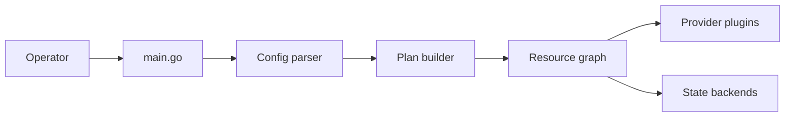

# hashicorp/terraform

> CLI d'infrastructure as code : décrire, planifier et appliquer des changements d'infrastructure, pour ops et MLOps.

## Le problème
Créer et modifier des ressources cloud à la main, sans plan ni versionnement, mène à des dérives et des erreurs.

## Ce que ça fait vraiment
Charge la configuration, construit un graphe de ressources, produit un plan d'exécution puis l'applique.
Parallélise les ressources indépendantes ; met à jour un état via des backends.
Les providers sont des plugins téléchargés depuis le Terraform Registry ; ce dépôt ne contient que le cœur et la CLI.
Opérations locales, distantes ou via Terraform Cloud.

## Comment c'est branché


## Essayer
```bash
# Aucune commande documentée dans le README : renvoi vers le site et le guide de contribution.
```

## Coût et pièges
Gratuit en local ; Terraform Cloud est un service HashiCorp. Licence présente mais non identifiée par GitHub : à lire avant usage commercial.

## Ce que ce n'est pas
Pas les providers (dépôts séparés), pas un outil de configuration de machines, pas de tutoriel dans le README.

## Alternatives
Non documenté.

## Pour toi
Standard de fait pour provisionner l'infra ML ; à maîtriser, en vérifiant la licence.
