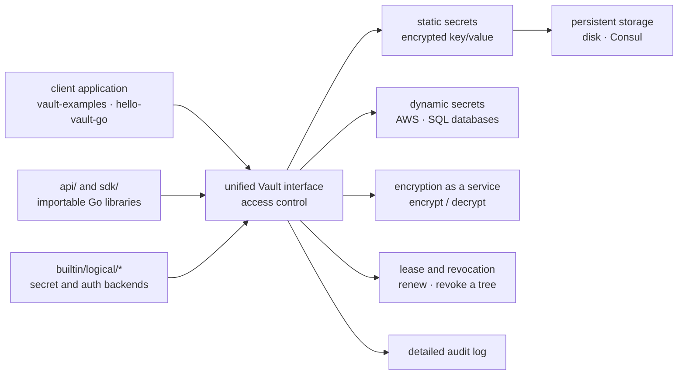

# hashicorp/vault

> **A server that stores, generates and revokes a system's secrets, with an access log.**

## The problem

A modern system accumulates database credentials, API keys for external services,
certificates and credentials for service-to-service communication. As the README puts it,
knowing *who accesses what* is already hard and platform-specific; adding key rolling,
encrypted storage and a detailed audit log on top is "almost impossible" without a custom
solution.

## What it actually does

Vault offers a single interface in front of any secret, with tight access control and an
audit log. The README lists five capabilities that are its own:

- **Encrypted secret storage** of arbitrary key/value pairs: encryption happens *before* the
  write, so reaching the raw storage (disk, Consul, others) is not enough to read secrets.
- **Dynamic secrets**: Vault mints credentials on demand for some systems. The README's
  example is an application that needs an S3 bucket: it asks, Vault generates an AWS keypair
  with the right permissions, then revokes it when the lease ends.
- **Data encryption without storage**: the security team sets the encryption parameters,
  developers keep the ciphertext wherever they like, such as a SQL database, without
  designing their own scheme.
- **Leasing and renewal**: every secret carries a lease; at its end Vault revokes
  automatically, and clients renew through built-in APIs.
- **Tree revocation**: not just one secret, but every secret read by a given user or every
  secret of a given type — useful for key rolling and for locking down after an intrusion.

The repository also publishes two Go libraries meant to be imported:
`github.com/hashicorp/vault/api` and `github.com/hashicorp/vault/sdk`.

## How it is wired

No code-derived diagram exists for this repository; the graph below is rebuilt from the
README alone, using the names it mentions.



## Trying it

The README documents no released-binary install: only building from source, which assumes Go
installed, `GOPATH` and `GOBIN` set, and a clone **outside** the `GOPATH`.

```sh
$ make bootstrap
...
$ make dev
...
$ bin/vault
...
```

With the web UI, then the tests (Docker required):

```sh
$ make static-dist dev-ui
...
$ bin/vault
...
$ make test
...
$ make test TEST=./vault
...
```

Acceptance tests, and running a Docker test against a locally built binary:

```sh
$ make testacc TEST=./builtin/logical/consul
...
$ GOOS=linux make dev
$ VAULT_BINARY=$(pwd)/bin/vault go test -run 'TestRaft_Configuration_Docker' ./vault/external_tests/raft/raft_binary
```

If `could not read Username for 'https://github.com'` appears, the README gives the fix:

```sh
$ git config --global --add url."git@github.com:".insteadOf "https://github.com/"
```

## Cost and gotchas

- **License**: the catalogue records `NOASSERTION` and the README names no license. That is
  the first thing to settle, against the repository's `LICENSE` file, before any internal
  use — all the more so as the README repeatedly points to the paid **Vault Enterprise**
  offering, which is separate from this repository.
- **Enterprise edition**: the replication test examples (PR and DR) require a local
  Enterprise binary and a license, passed via `VaultLicense` or, as the README recommends,
  through the `VAULT_LICENSE_CI` environment variable rather than committed to version
  control.
- **Docker is required for `make test`** — the README states it, it is not optional.
- **Acceptance tests create, modify and destroy *real resources*** and "may incur real costs".
  The README advises running them in a dedicated private account, and warns that a bug can
  leave dangling data behind.
- **Access environment variables**: acceptance tests need credentials for the backend under
  test; they are not listed, the test errors early and tells you what to set.
- **Importing `github.com/hashicorp/vault` is unsupported**: only `api` and `sdk` are. The
  README says bugs about importing the main module are unlikely to be fixed.
- The `testcluster/docker` testing mechanism is described as **experimental** in the README.

## What it is not

- **Not a crypto library you link into your code.** It is a service to deploy, operate and
  monitor: the secret lives behind an API, not inside your process. The README documents
  neither production deployment, nor unsealing, nor high availability — all of it is deferred
  to the documentation site.
- **Not a password manager for humans**: the target is applications and services, with
  leases, automatic revocation and auditing.
- **This repository is not the whole product**: Vault Enterprise, its replication features and
  its commercial license live elsewhere. The hidden cost is there, not in the install.

## Alternatives

| | When to prefer it |
|---|---|
| **hashicorp/consul** | Named in the README, but as a *storage backend* for Vault rather than a substitute: put it behind Vault when you want distributed storage instead of local disk. |
| **golang-jwt/jwt** | A catalogue neighbour of a different order: a Go library for signing and verifying tokens inside your own process. Prefer it when the need is token authentication rather than centralised secret lifecycle management. |

The other catalogue neighbours (`anchore/grype`, `go-resty/resty`, `j3ssie/osmedeus`) are not
comparable: a vulnerability scanner, an HTTP client and an offensive reconnaissance framework.

## For you

Worth adopting, but as infrastructure groundwork rather than a project dependency: as soon as
a data pipeline or an inference service carries provider API keys, database credentials or
object-storage tokens, leased dynamic secrets and tree revocation beat environment variables
copied around. The flip side is one more service to operate, and a license to check before
bringing it in.
