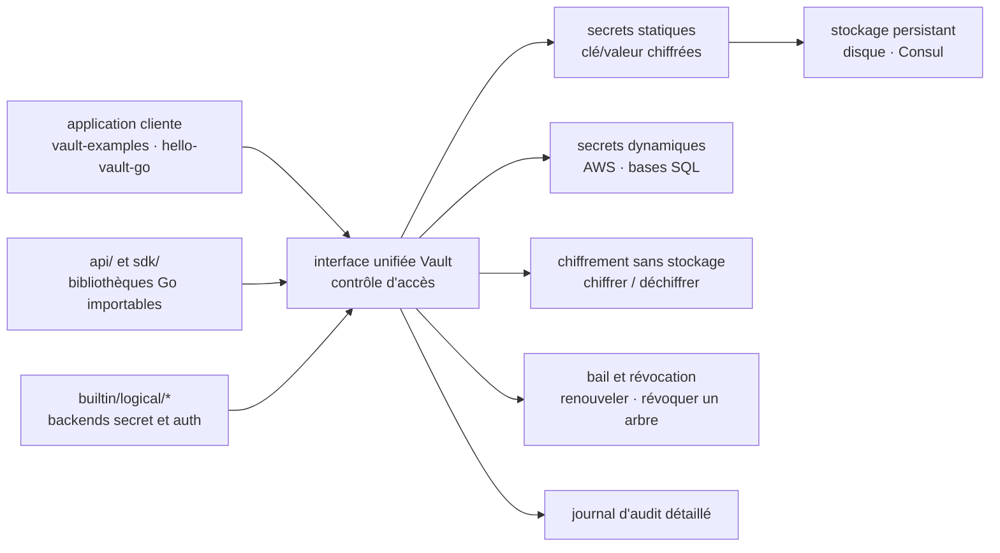

# hashicorp/vault

> **Un serveur qui stocke, génère et révoque les secrets d'un système, avec journal d'accès.**

## Le problème

Un système moderne accumule des identifiants de base de données, des clés d'API de services
externes, des certificats et des identifiants de communication entre services. Le README
décrit le résultat : savoir *qui accède à quoi* est déjà difficile et dépend de chaque
plateforme ; y ajouter la rotation des clés, le stockage chiffré et un journal d'audit
détaillé est « presque impossible » sans une solution maison.

## Ce que ça fait vraiment

Vault expose une interface unique devant n'importe quel secret, avec contrôle d'accès et
journal d'audit. Le README énumère cinq capacités qui lui sont propres :

- **Stockage chiffré** de paires clé/valeur arbitraires : le chiffrement a lieu *avant*
  l'écriture, donc accéder au stockage brut (disque, Consul, autres) ne suffit pas à lire
  les secrets.
- **Secrets dynamiques** : Vault fabrique l'identifiant à la demande pour certains systèmes.
  L'exemple du README est une application qui veut un compartiment S3 : elle demande, Vault
  génère une paire de clés AWS avec les permissions voulues, puis la révoque à l'échéance.
- **Chiffrement de données sans stockage** : l'équipe sécurité fixe les paramètres, les
  développeurs rangent le résultat chiffré où ils veulent, par exemple dans une base SQL,
  sans concevoir leur propre schéma de chiffrement.
- **Bail et renouvellement** : chaque secret porte un bail ; à son terme Vault révoque
  automatiquement, et les clients renouvellent via des API dédiées.
- **Révocation en arbre** : pas seulement un secret isolé, mais tous ceux lus par un
  utilisateur donné ou tous ceux d'un type donné — pour la rotation comme pour le
  verrouillage après intrusion.

Le dépôt publie aussi deux bibliothèques Go destinées à être importées :
`github.com/hashicorp/vault/api` et `github.com/hashicorp/vault/sdk`.

## Comment c'est branché

Aucun diagramme tiré du code n'existe pour ce dépôt ; ce schéma est reconstruit depuis le
seul README, avec les noms qu'il cite.



## Essayer

Le README ne documente pas l'installation d'un binaire publié : il décrit uniquement la
compilation depuis les sources, qui suppose Go installé, `GOPATH` et `GOBIN` réglés, et un
clone **hors** du `GOPATH`.

```sh
$ make bootstrap
...
$ make dev
...
$ bin/vault
...
```

Avec l'interface web, puis les tests (Docker requis) :

```sh
$ make static-dist dev-ui
...
$ bin/vault
...
$ make test
...
$ make test TEST=./vault
...
```

Tests d'acceptation, et exécution d'un test Docker avec un binaire compilé localement :

```sh
$ make testacc TEST=./builtin/logical/consul
...
$ GOOS=linux make dev
$ VAULT_BINARY=$(pwd)/bin/vault go test -run 'TestRaft_Configuration_Docker' ./vault/external_tests/raft/raft_binary
```

Si `could not read Username for 'https://github.com'` apparaît, le README donne le correctif :

```sh
$ git config --global --add url."git@github.com:".insteadOf "https://github.com/"
```

## Coût et pièges

- **Licence** : le catalogue relève `NOASSERTION` et le README ne nomme aucune licence. C'est
  l'alerte à lever en premier, sur le fichier `LICENSE` du dépôt, avant tout usage interne —
  d'autant que le README renvoie à plusieurs reprises à l'offre **Vault Enterprise**, payante,
  distincte de ce dépôt.
- **Édition Enterprise** : les exemples de tests de réplication (PR et DR) exigent un binaire
  Enterprise local et une licence, passée par `VaultLicense` ou, recommandé par le README,
  par la variable d'environnement `VAULT_LICENSE_CI` plutôt que versionnée.
- **Docker obligatoire pour `make test`** : ce n'est pas optionnel, le README le précise.
- **Les tests d'acceptation créent, modifient et détruisent de *vraies* ressources** et
  « peuvent engendrer de vrais coûts ». Le README recommande de les lancer dans un compte
  privé dédié, et avertit qu'un bug peut laisser des données orphelines derrière lui.
- **Variables d'environnement d'accès** : les tests d'acceptation en réclament (clés d'accès
  au fournisseur testé) ; elles ne sont pas listées, le test échoue tôt et indique quoi régler.
- **Importer `github.com/hashicorp/vault` n'est pas supporté** : seuls `api` et `sdk` le sont.
  Le README annonce que les bugs d'import du module principal ne seront probablement pas
  corrigés.
- Le mécanisme de tests Docker à base de `testcluster/docker` est qualifié d'**expérimental**
  par le README.

## Ce que ce n'est pas

- **Ce n'est pas une bibliothèque de chiffrement à lier dans son code.** C'est un service à
  déployer, exploiter et surveiller : le secret vit derrière une API, pas dans le processus.
  Le README ne documente d'ailleurs ni le déploiement en production, ni le descellement, ni la
  haute disponibilité — tout cela est renvoyé au site de documentation.
- **Ce n'est pas un gestionnaire de mots de passe pour personnes** : la cible est
  l'application et le service, avec baux, révocation automatique et audit.
- **Ce dépôt n'est pas le produit complet** : Vault Enterprise, ses fonctions de réplication
  et sa licence commerciale sont ailleurs. Le coût caché est là, pas à l'installation.

## Alternatives

| | Quand le préférer |
|---|---|
| **hashicorp/consul** | Nommé dans le README, mais comme *backend de stockage* de Vault, pas comme substitut : à mettre derrière Vault si l'on veut un stockage distribué plutôt que le disque local. |
| **golang-jwt/jwt** | Voisin de catalogue, d'un autre ordre : une bibliothèque Go pour signer et vérifier des jetons dans son propre processus. À préférer quand le besoin est l'authentification par jeton et non la gestion centralisée du cycle de vie des secrets. |

Les autres voisins du catalogue (`anchore/grype`, `go-resty/resty`, `j3ssie/osmedeus`) ne sont
pas comparables : scanner de vulnérabilités, client HTTP et cadre de reconnaissance offensive.

## Pour toi

À adopter, mais comme socle d'infrastructure, pas comme dépendance de projet : dès qu'une
chaîne de données ou un service d'inférence porte des clés d'API de fournisseurs, des
identifiants de base ou des jetons de stockage objet, les secrets dynamiques à bail et la
révocation en arbre valent mieux que des variables d'environnement recopiées. Le corollaire
est un service de plus à exploiter, et une licence à vérifier avant de l'introduire.
