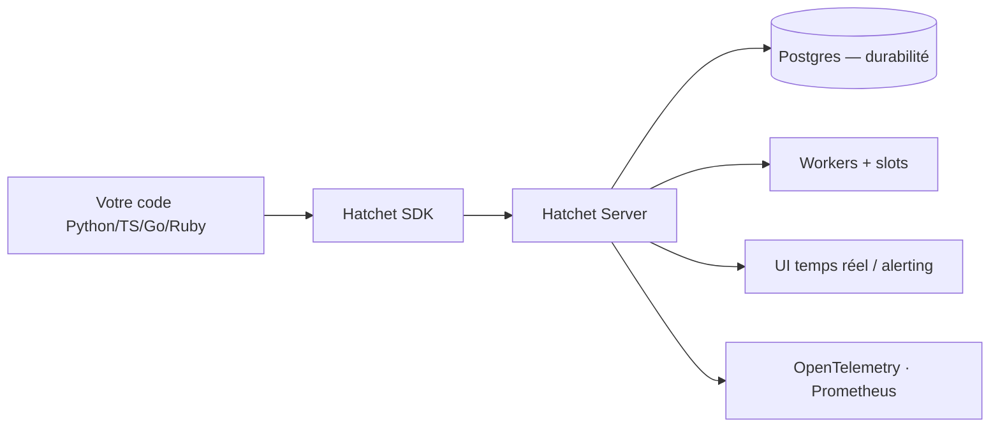

# hatchet-dev/hatchet

> Moteur d'orchestration de tâches de fond et de workflows durables, adossé à Postgres.

## Le problème
Celery et BullMQ perdent l'historique dès la tâche finie : impossible de rejouer un échec, pas
d'état intermédiaire, et il faut bricoler un outil d'admin pour s'y retrouver à l'échelle.

## Ce que ça fait vraiment
File de tâches durable : tout l'historique d'exécution est persisté (jusqu'à une rétention
définie). Tâches uniques, cron, déclenchement par événement ou webhook. Tâches durables et DAG
pour les workflows longs, avec pauses sur sommeil durable ou attente d'événement. Priorités,
limites de débit dynamiques, ordonnancement équitable par clés de concurrence, slots par worker.
UI temps réel, OpenTelemetry, métriques Prometheus, multi-tenant natif. SDK Python, TypeScript,
Go, Ruby.

## Comment c'est branché


## Essayer
```bash
curl -fsSL https://install.hatchet.run/install.sh | bash
hatchet --version
hatchet server start
```

## Coût et pièges
Auto-hébergeable, mais la CLI locale exige Docker. La durabilité a un prix assumé : testé jusqu'à
10 000 tâches/seconde, mais plus gourmand en ressources qu'un Redis ou un RabbitMQ. Autoscaling,
multi-région, SSO et observabilité améliorée sont réservés à Hatchet Cloud.

## Ce que ce n'est pas
Ce n'est pas un orchestrateur de données à connecteurs : le README renvoie explicitement vers
Airflow/Prefect/Dagster si tu veux des intégrations prêtes à l'emploi. Ce n'est pas le débit
maximal : un broker Redis ira plus haut.

## Alternatives
- **Temporal / DBOS** : l'exécution durable seule, sans file ni DAG.
- **Celery / BullMQ** : plus simples et plus rapides si tu n'as pas besoin de durabilité.
- **Airflow / Prefect / Dagster** : pour des pipelines data avec connecteurs prêts.

## Pour toi
Le bon compromis si tes pipelines IA doivent reprendre après échec sans perdre le contexte.
