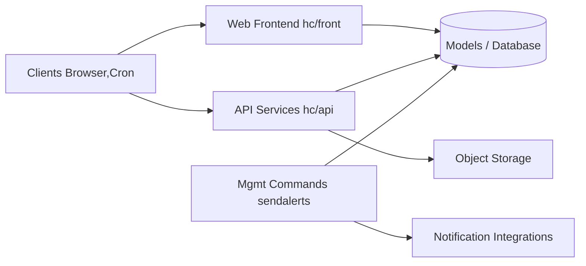

# healthchecks/healthchecks

> Service Django de surveillance des tâches cron : alerte quand un ping attendu n'arrive pas.

## Le problème
Un cron ou un job planifié qui échoue silencieusement passe inaperçu pendant des jours.

## Ce que ça fait vraiment
Chaque « check » reçoit des pings HTTP ou e-mail ; période + délai de grâce ou expression cron (via cronsim).
`sendalerts` surveille la base et notifie via 25+ intégrations (Slack, Telegram, Signal, Matrix, PagerDuty, Apprise, commandes shell).
Tableau de bord live, API, badges, rapports mensuels, 2FA WebAuthn, équipes et projets.
Python 3.12+, Django, PostgreSQL/MySQL/MariaDB (SQLite par défaut en dev) ; stockage S3 optionnel des corps de ping.

## Comment c'est branché


## Essayer
```bash
python3 -m venv .venv
source .venv/bin/activate
git clone https://github.com/healthchecks/healthchecks.git
pip install -r healthchecks/requirements.txt -r healthchecks/requirements-dev.txt
cd ~/webapps/healthchecks
./manage.py migrate
./manage.py createsuperuser
./manage.py runserver
```

## Coût et pièges
Gratuit, BSD-3 en auto-hébergé ; healthchecks.io en service hébergé. `sendalerts` doit tourner en permanence ; reverse proxy obligatoire (X-Forwarded-For).

## Ce que ce n'est pas
Pas un monitoring de métriques ni d'uptime HTTP actif : il attend passivement des pings.

## Alternatives
Aucune nommée dans le README.

## Pour toi
À surveiller : simple et fiable pour être alerté quand un job d'ingestion ou de réentraînement planifié ne tourne pas, un `curl` en fin de script suffit.
