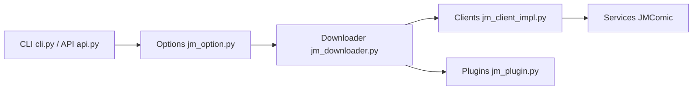

# hect0x7/JMComic-Crawler-Python

> API et CLI Python pour télécharger des albums du site JMComic, avec contournement de Cloudflare.

## Le problème
Récupérer et décoder les images d'albums d'un site précis, sans API publique.

## Ce que ça fait vraiment
Fournit une API synchrone et asynchrone, une CLI (`jmcomic`, `jmv`), un système d'options YAML, 21 plugins (PDF, zip, long image, favoris) et un téléchargeur GitHub Actions. Gère la recherche, les commentaires, classements, favoris et l'authentification du client mobile.

## Comment c'est branché


## Essayer
```bash
pip install jmcomic -U
jmcomic 123
```

## Coût et pièges
Gratuit. Le contenu visé est du contenu adulte (le README parle de « bypass » anti-bot) ; risques juridiques et de blocage côté site. Ne pas télécharger en masse.

## Ce que ce n'est pas
Pas un outil généraliste de scraping ni un projet professionnel. Documentation parfois en retard, de l'aveu de l'auteur.

## Alternatives
Aucune alternative nommée dans le README.

## Pour toi
À ignorer : sujet sans rapport avec ton métier et zone juridique sensible.

