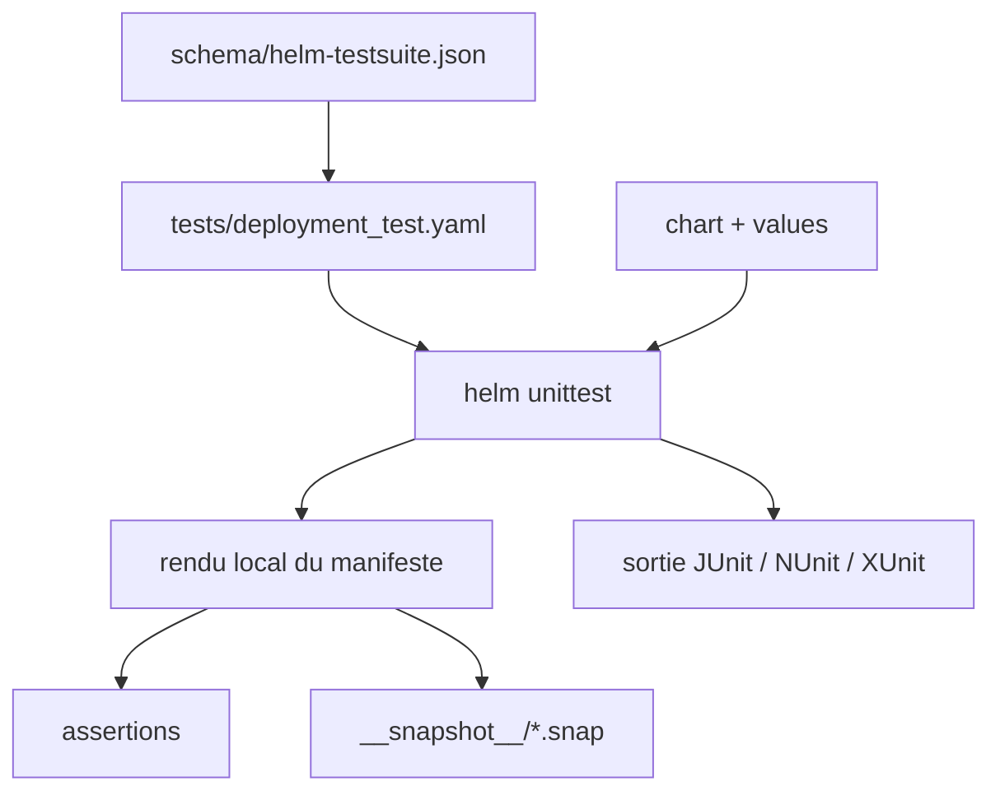

# helm-unittest/helm-unittest

> Plugin Helm qui teste le rendu d'un chart en YAML, localement, sans rien créer sur le cluster.

## Le problème
Une modification de chart Helm ne se vérifie qu'au déploiement, donc sur un vrai cluster et trop tard.
`helm lint` valide la forme, pas le contenu du manifeste effectivement produit.

## Ce que ça fait vraiment
Les tests s'écrivent en YAML pur dans `tests/*_test.yaml` : on fixe des valeurs, on sélectionne des templates, on pose des assertions (`isKind`, `equal`, `matchRegex`).
Rend le chart en local et ne crée rien sur le cluster.
Gère le test par instantané (`matchSnapshot`), les instantanés étant versionnés dans `__snapshot__/*.snap` à côté des tests.
Sélectionne un document par `documentSelector` avec support JsonPath, teste les sous-charts dépendants depuis le chart racine, et accepte des suites générées par un chart de test (`--chart-tests-path`).

## Comment c'est branché


## Essayer
```bash
helm plugin install https://github.com/helm-unittest/helm-unittest.git
helm unittest $YOUR_CHART
helm unittest -u my-chart
helm unittest --parallel --max-workers 4 ./charts/my-app
docker run -ti --rm -v $(pwd):/apps helmunittest/helm-unittest
```

## Coût et pièges
Avec Helm 4, l'installation depuis le dépôt git impose `--verify=false` : la vérification GPG par webhook n'est pas gérée.
Le téléchargement OCI embarque tous les OS et architectures, donc un paquet plus lourd, et n'existe qu'à partir de la version 1.1.0.
`--max-workers` n'a aucun effet sans `--parallel`, et `--parallel` est ignoré si `--debugPlugin` est posé.

## Ce que ce n'est pas
Ce n'est pas `helm test`, qui lui crée un pod de test sur le cluster.
Ce n'est pas un validateur de déploiement : le rendu réussi d'un manifeste ne garantit pas qu'il s'applique.
Penser à ajouter `tests` dans `.helmignore`, et à ignorer `*/__snapshot__/*` avec des suites générées.

## Alternatives
- pytest-helm-charts : même besoin depuis Python, si l'équipe préfère écrire ses tests en code.
- terratest : équivalent Go, pour des tests d'infrastructure plus larges que le seul rendu.

## Pour toi
À adopter dès que tu maintiens un chart Helm que d'autres déploient ; le coût d'entrée se compte en minutes.
