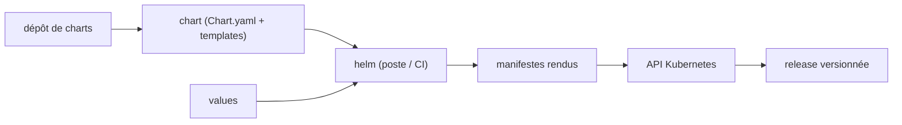

# helm/helm

> Gestionnaire de paquets pour Kubernetes : installe et versionne des applications empaquetées.

## Le problème
Déployer une application Kubernetes revient à maintenir des dizaines de manifestes YAML quasi identiques.
Rejouer un déploiement à l'identique, ou le rouler en arrière, n'a rien de natif.

## Ce que ça fait vraiment
Un chart est un paquet contenant au minimum un `Chart.yaml` et des templates de manifestes Kubernetes.
Helm rend les templates localement puis dialogue avec l'API Kubernetes ; il tourne sur ton poste ou en CI.
Les charts vivent sur disque ou dans des dépôts distants, comme des paquets Debian ou RedHat.
Il gère les *releases* : versions installées, mises à jour, retours arrière.

## Comment c'est branché


## Essayer
```bash
brew install helm
choco install kubernetes-helm
winget install Helm.Helm
scoop install helm
snap install helm --classic
mise use -g helm@latest
```

## Coût et pièges
Gratuit, mais il faut un cluster Kubernetes accessible — c'est là qu'est la facture réelle.
Helm v3 n'est plus qu'en support : correctifs jusqu'au 8 juillet 2026, sécurité jusqu'au 11 novembre 2026.

## Ce que ce n'est pas
Ce n'est pas un runtime : Helm rend et envoie, il ne remplace ni le cluster ni `kubectl`.
Ce n'est pas un système de configuration générique : la sortie est du manifeste Kubernetes.
Le README ne documente ni la licence ni la gouvernance du projet.

## Alternatives
Aucune alternative nommée dans le README.

## Pour toi
Incontournable dès que tes modèles ou tes pipelines tournent sur Kubernetes ; inutile sinon.
