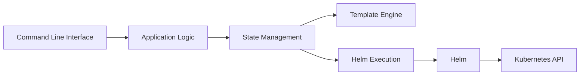

# helmfile/helmfile

> Spécification déclarative pour déployer des charts Helm, pour équipes qui gèrent des clusters Kubernetes.

## Le problème
Les déploiements Helm dérivent d'un environnement à l'autre quand ils ne sont pas versionnés.

## Ce que ça fait vraiment
Un fichier `helmfile.yaml` décrit repositories et releases ; `helmfile apply` synchronise le cluster. Il délègue à `helm` et au plugin `helm-diff`. Il gère des modules réutilisables, des kustomizations et répertoires de ressources convertis en releases Helm, et des patchs JSON ou strategic-merge sans forker les charts.

## Comment c'est branché


## Essayer
```bash
helmfile create my-project && cd my-project
helmfile apply
```
Après installation, lancer une fois `helmfile init`.

## Coût et pièges
Gratuit. Nécessite `helm` et `helm-diff`. Passer de v0 à v1.1 implique quelques ruptures.

## Ce que ce n'est pas
Pas un remplaçant de Helm : il l'appelle. Ce n'est pas un outil GitOps continu.

## Alternatives
Le README ne nomme aucune alternative.

## Pour toi
À surveiller : utile si tu déploies des services MLOps sur Kubernetes via Helm, sinon hors sujet.
