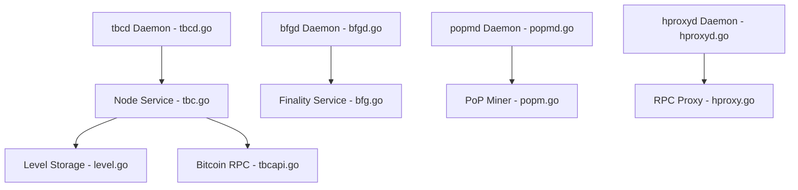

# hemilabs/heminetwork

> Démons Go du réseau Hemi (L2 EVM ancré sur Bitcoin) : nœud Bitcoin, finalité, mineur PoP, proxy RPC.

## Le problème
Un L2 compatible EVM qui veut hériter de la sécurité de Bitcoin a besoin de services pour lire Bitcoin, exposer la finalité et miner les preuves.

## Ce que ça fait vraiment
Quatre démons : `tbcd` (nœud Bitcoin personnalisé et embarquable), `bfgd` (information de finalité via API), `popmd` (mineur Proof-of-Proof avec portefeuille Bitcoin) et `hproxyd` (équilibrage de requêtes RPC vers les nœuds op-geth de Hemi). S'y ajoutent `btctool`, `hemictl` et `keygen`. Le nœud Hemi L2 est dans un autre dépôt.

## Comment c'est branché


## Essayer
```bash
git clone https://github.com/hemilabs/heminetwork.git
cd heminetwork
make deps
make install
```
Des images Docker existent : `hemilabs/bfgd`, `hemilabs/hproxyd`, `hemilabs/popmd`, `hemilabs/tbcd`.

## Coût et pièges
Go 1.26+, `git`, `make`. Faire tourner `tbcd` implique d'indexer Bitcoin (espace disque non précisé dans le README). Le mineur PoP manipule des clés Bitcoin.

## Ce que ce n'est pas
Pas le nœud Hemi complet (voir hemilabs/hemi-node). Pas un outil d'analyse de données blockchain prêt à l'emploi.

## Alternatives
- hemilabs/hemi-node : documentation et fichiers pour exécuter les nœuds L2.

## Pour toi
À ignorer : infrastructure blockchain, loin du profil data/IA/MLOps, sauf si tu travailles justement sur Hemi.

