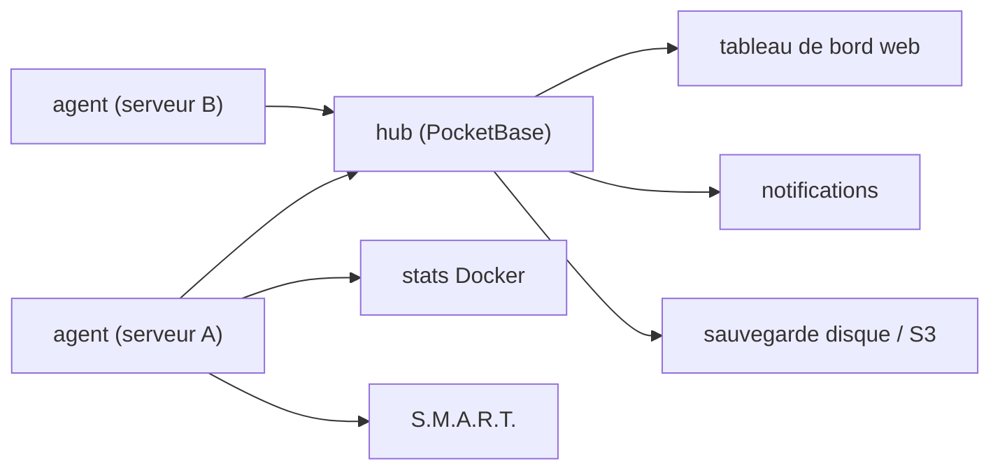

# henrygd/beszel

> Supervision légère de serveurs et de conteneurs Docker, avec historique et alertes.

## Le problème
Les solutions de supervision classiques consomment plus de ressources que ce qu'elles surveillent.
Suivre l'usage CPU et mémoire par conteneur demande habituellement une pile complète à déployer.

## Ce que ça fait vraiment
Deux composants : un hub (application web bâtie sur PocketBase) et un agent installé sur chaque machine surveillée.
L'agent remonte les métriques système et, conteneur par conteneur, l'historique CPU, mémoire et réseau.
Alertes configurables sur la plupart des métriques, vers de nombreux services de notification ; santé des disques S.M.A.R.T. avec alerte sur panne.
Multi-utilisateurs avec partage de systèmes par les administrateurs, OAuth2/OIDC (mot de passe désactivable), API, sauvegardes disque ou S3.

## Comment c'est branché

## Essayer
Aucune commande d'installation n'est écrite dans le README : il renvoie au guide de démarrage rapide sur beszel.dev.

## Coût et pièges
Gratuit ; un agent doit être installé et maintenu sur chaque machine surveillée.
L'auteur prévient qu'il ne peut pas toujours répondre et demande de chercher dans l'existant d'abord.

## Ce que ce n'est pas
Ce n'est pas un système d'observabilité applicative : métriques machine et conteneur, pas de traces ni de logs.
Ce n'est pas une offre gérée : le hub est une application à héberger soi-même.
Le README ne déclare ni licence, ni prérequis précis, ni méthode d'installation.

## Alternatives
Aucune alternative nommée dans le README, seulement une comparaison implicite aux « leading solutions ».

## Pour toi
Utile pour surveiller un serveur d'entraînement ou une machine de calcul sans monter une pile Prometheus.
