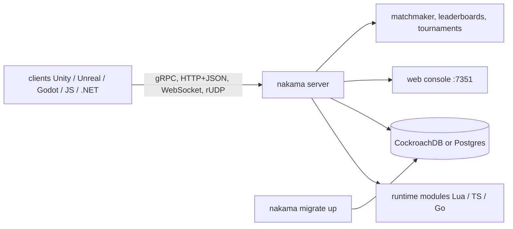

# heroiclabs/nakama

> **A self-hosted game server**: accounts, storage, social graph, chat, realtime multiplayer, leaderboards.

## The problem

Without it, a studio rewrites the same server layer for every title: login via social networks,
email or device ID, friends and groups, persistent chat, matchmaking, seasonal leaderboards,
in-app purchase validation. Each brick is ordinary; assembling and operating them all is not.

## What it actually does

Nakama is a server written in Go that exposes those functions over an API. The README lists:
register/login via social networks, email or device ID; storage of user records and objects in
collections; a social graph with friends and groups; 1-on-1, group and global chat with message
history; realtime or turn-based multiplayer; leaderboards and tournaments; parties for team play;
purchase and subscription validation; in-app notifications; a matchmaker, a dashboard and metrics.
Server behaviour is extended with runtime code in Lua, TypeScript/JavaScript or native Go. A web
console ships inside the same binary at `http://127.0.0.1:7351`. It requires CockroachDB or
another Postgres wire-compatible server as its database.

## How it is wired



No code-derived diagram exists for this repository, so the nodes above come from the README.
The protocols are stated there: gRPC or an HTTP1.1+JSON (REST) fallback for request/response,
WebSockets or rUDP for realtime. There is a single binary, console included.

## Trying it

```shell
docker-compose -f ./docker-compose.yml up
```

With native binaries, after downloading the server and the database:

```shell
nakama migrate up --database.address "root@127.0.0.1:26257"
nakama --database.address "root@127.0.0.1:26257"
```

Checking the API:

```shell
curl "127.0.0.1:7350/v2/account/authenticate/device?create=true" \
  --user "defaultkey:" \
  --data '{"id": "someuniqueidentifier"}'
```

Building from source:

```shell
git clone "https://github.com/heroiclabs/nakama" nakama
cd nakama
go build -trimpath -mod=vendor
./nakama --version
```

## Cost and gotchas

The code is Apache-2 licensed, with no API key and no account to create. The real cost is
infrastructure: the README says to provision separate nodes for Nakama and CockroachDB, suggests
at least an "n1-standard-1" instance for Nakama in production, and points to CockroachDB's own
hardware recommendations. The docker-compose file is not in the repository — it has to be taken
from the online documentation. Heroic Cloud, the vendor's managed hosting, is the paid offering
that funds development. The README mentions a dashboard and service metrics; it describes no
reporting to a third party.

## What it is not

It is not a game engine and not a turnkey service: you host it, operate it and run its database.
It is not a stateless generic backend either — CockroachDB or a Postgres wire-compatible server is
required. Game logic is not included: authoritative match rules are written by you in the Lua,
TypeScript or Go runtime modules. And it is not a community project: the roadmap is held by
Heroic Labs, which sells the hosting.

## Alternatives

No comparable alternative in the catalogue: the proposed neighbours (pulumi/pulumi and
pulumi/pulumi-aws for infrastructure as code, adnanh/webhook for running commands from an HTTP
hook, LeCoupa/awesome-cheatsheets, a list) cover none of these game-backend functions. The README
names no competitor, only CockroachDB as the required database.

## Why it matters to you

Little overlap with a data / AI / MLOps role, unless you work on social or realtime products: in
that case it is a serious Apache-2 base that gives you accounts, sessions, WebSockets and storage
from the start. Worth watching rather than adopting by default — the CockroachDB coupling and the
operational load of a stateful server are a commitment of their own.
