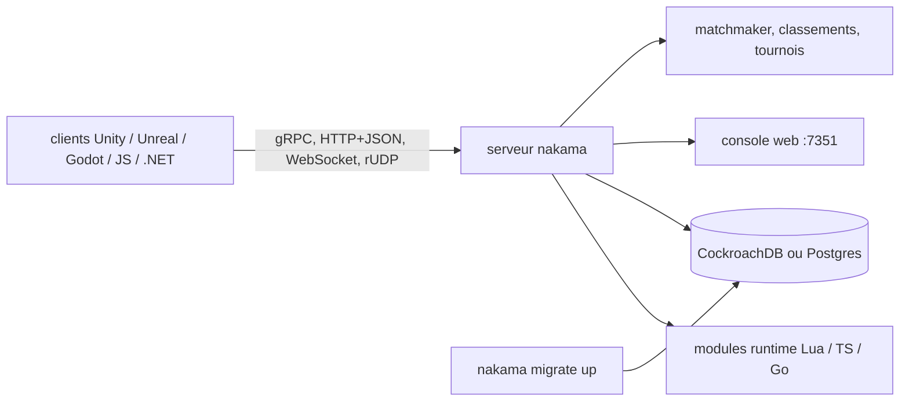

# heroiclabs/nakama

> **Un serveur de jeu à héberger soi-même** : comptes, stockage, social, chat, multijoueur temps réel, classements.

## Le problème

Sans lui, un studio réécrit à chaque titre la même couche serveur : authentification par réseau
social ou device ID, amis et groupes, chat persistant, matchmaking, classements saisonniers,
validation des achats in-app. Chacune de ces briques est banale, l'ensemble ne l'est pas.

## Ce que ça fait vraiment

Nakama est un serveur écrit en Go qui expose ces fonctions par API. Le README liste :
inscription/connexion (réseaux sociaux, e-mail, device ID), stockage d'objets en collections,
graphe social (amis, groupes), chat 1-à-1 / groupe / global avec historique, multijoueur temps
réel ou tour par tour, classements et tournois, parties (groupes d'équipe), validation des
achats et abonnements, notifications in-app, matchmaker, dashboard et métriques. Le serveur
s'étend par du code exécuté côté serveur en Lua, TypeScript/JavaScript ou Go natif. Une console
web est embarquée dans le même binaire, sur `http://127.0.0.1:7351`. Il lui faut une base
CockroachDB ou tout serveur compatible avec le protocole Postgres.

## Comment c'est branché



Aucun diagramme tiré du code n'existe pour ce dépôt : les nœuds ci-dessus viennent du README.
Les protocoles y sont explicites : gRPC ou repli HTTP1.1+JSON pour le requête/réponse,
WebSocket ou rUDP pour le temps réel. Le binaire est unique — console comprise.

## Essayer

```shell
docker-compose -f ./docker-compose.yml up
```

En binaires natifs, après avoir téléchargé le serveur et la base :

```shell
nakama migrate up --database.address "root@127.0.0.1:26257"
nakama --database.address "root@127.0.0.1:26257"
```

Vérifier l'API :

```shell
curl "127.0.0.1:7350/v2/account/authenticate/device?create=true" \
  --user "defaultkey:" \
  --data '{"id": "someuniqueidentifier"}'
```

Construire depuis les sources :

```shell
git clone "https://github.com/heroiclabs/nakama" nakama
cd nakama
go build -trimpath -mod=vendor
./nakama --version
```

## Coût et pièges

Le code est sous Apache-2, sans clé d'API ni compte à créer. Le coût réel est celui de
l'infrastructure : le README recommande de provisionner des nœuds séparés pour Nakama et pour
CockroachDB, avec au minimum un « n1-standard-1 » en production côté Nakama et les
recommandations matérielles de CockroachDB côté base. Le fichier docker-compose n'est pas dans
le dépôt : il est à récupérer dans la documentation en ligne. Heroic Cloud, l'hébergement géré
de l'éditeur, est l'offre payante qui finance le projet. Le README mentionne dashboard et
métriques de service ; rien n'y décrit de remontée vers un tiers.

## Ce que ce n'est pas

Ce n'est pas un moteur de jeu ni un service clé en main : il faut l'héberger, l'exploiter, et
gérer sa base. Ce n'est pas non plus un backend générique sans état — il impose CockroachDB ou
un serveur compatible Postgres. La logique métier n'est pas fournie : le multijoueur autoritatif
et les règles de partie s'écrivent dans les modules Lua, TypeScript ou Go. Enfin, ce n'est pas
un projet communautaire : la feuille de route est tenue par Heroic Labs, qui vend l'hébergement.

## Alternatives

Aucune alternative comparable dans le catalogue : les voisins proposés (pulumi/pulumi et
pulumi/pulumi-aws pour l'infrastructure as code, adnanh/webhook pour déclencher des commandes sur
un hook HTTP, LeCoupa/awesome-cheatsheets qui est une liste) ne couvrent aucune des fonctions de
backend de jeu. Le README ne nomme aucun concurrent, seulement CockroachDB comme base requise.

## Pour toi

Peu de recouvrement avec un poste data / IA / MLOps, sauf si tu travailles sur des produits
sociaux ou du temps réel : dans ce cas c'est une base sérieuse, Apache-2, qui fournit d'emblée
comptes, sessions, WebSocket et stockage. À surveiller plutôt qu'à adopter par défaut : le
couplage à CockroachDB et l'exploitation d'un serveur d'état sont un engagement à part entière.
