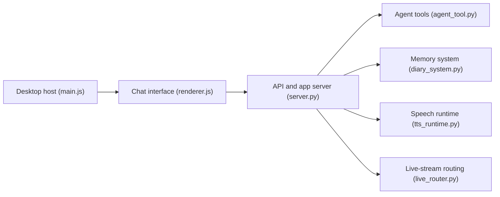

# heshengtao/super-agent-party

> Compagnon IA de bureau avec avatars animés, outils d'agent, mémoire et bots de messagerie.

## Le problème
Assembler chat, voix, avatar, outils MCP et connecteurs de messageries autour d'un agent demande beaucoup de pièces.

## Ce que ça fait vraiment
Application Electron (Windows, macOS, Linux AppImage) ou Docker, avec un serveur Python exposant une API compatible OpenAI et un point MCP. Elle gère des fournisseurs LLM variés, avatars VRM/THA, VTube Studio, bots (QQ, WeChat, Feishu, Telegram, Discord, Slack), live streaming (Bilibili, YouTube, Twitch), mémoire, commandes rapides et système d'extensions. Un mode de contrôle de l'ordinateur (souris, clavier, terminal) existe.

## Comment c'est branché

Le câblage serveur/Electron n'a pas été extrait de l'architecture.

## Essayer
```bash
docker pull ailm32442/super-agent-party:latest
docker run -d -p 3456:3456 -v ./super-agent-data:/app/data ailm32442/super-agent-party:latest
# puis http://localhost:3456/
```

## Coût et pièges
Clés d'API de tes fournisseurs LLM. En Docker Compose, identifiants par défaut `root` / `pass` à changer. Le contrôle du poste donne à l'agent des droits étendus.

## Ce que ce n'est pas
Pas un framework léger : surface énorme, plusieurs fonctions reposent sur des interfaces tierces instables (README). Licence AGPL-3.0.

## Alternatives
Aucune alternative nommée dans le README.

## Pour toi
À surveiller : démonstrateur riche mais orienté compagnon et streaming ; l'AGPL et le contrôle du poste pèsent pour un usage professionnel.

