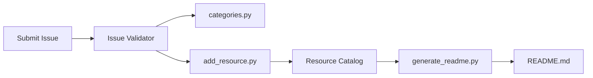

# hesreallyhim/awesome-claude-code

> Liste commentée de skills, plugins, hooks et outils pour Claude Code, destinée à ses utilisateurs.

## Le problème
L'écosystème Claude Code produit des centaines de dépôts par mois ; trier le sérieux du bruit prend du temps.

## Ce que ça fait vraiment
Un README catégorisé : guides, ressources Anthropic, orchestration, sécurité, mémoire, observabilité, status lines, etc.
Chaque entrée porte un commentaire éditorial de l'auteur.
Côté code : un CSV canonique, un validateur de soumissions par issue, `generate_readme.py` qui régénère le README.
Un « ticker » récupère des métriques GitHub et produit des SVG.

## Comment c'est branché


## Essayer
```bash
# Aucune commande documentée : c'est une liste à lire.
```

## Coût et pièges
Rien. La liste est en refonte : des ressources « legacy » sont temporairement dans `README_ALTERNATIVES`.

## Ce que ce n'est pas
Pas un catalogue exhaustif ni neutre : la sélection et les jugements sont ceux d'une personne. Pas un outil installable.

## Alternatives
Non documenté (le README cite des ressources, pas de liste concurrente).

## Pour toi
Bonne porte d'entrée pour piocher des skills ou hooks ; à parcourir, pas à adopter.
